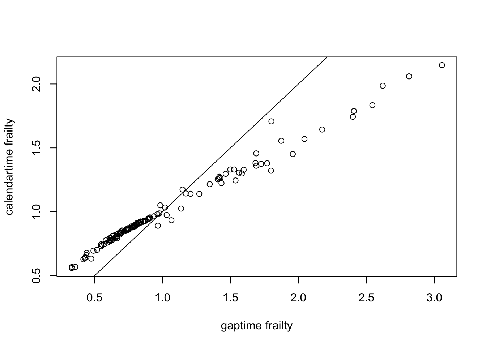

# Frailty Models: Theory & Practice  
Computer Practical
Theodor Balan and Hein Putter  
11/3/2017  


# Introduction

The goal of this practical is to introduce you to fitting frailty models in R. We will try out functions from the `survival` and `frailtyEM` packages. We will not focus on covariate selection or cover the medical implications of the data analysis. Make sure that you have an up-to-date R installation. 

The data that we will use comes from a placebo controlled trial of gamma interferon in chronic granulotomous disease (CGD). The main study based on these data was published as Gallin, J. I., et al. *A controlled trial of interferon gamma to prevent infection in chronic granulomatous disease*, in The New England Journal of Medicine 324.8 (1991): 509-516. The data set is available in numerous `R` packages, including the `survival` package. 

### Variables
The structure of the data is as follows:

- `id`: subject id
- `center`: the centers where the trial took place
- `random`: randomization date
- `treat`: treatment arm: `rIFN-g` or `placebo`
- `sex`: `female` or `male`
- `age`: age in years at time of study entry
- `height`: height in cm at time of study entry
- `weight`: weight in kg at time of study entry
- `inherit`: pattern of inheritance: `autosomal` (autosomal recessive) or `X-linked`
- `propylac`: use of prophylactic antibiotics at time of study entry (`0` for no, and `1` for yes)
- `hos.cat`: institution category: `US:other`, `US:NIH`, `Europe: Amsterdam` and `Europe:other`
- `tstart`, `tstop`, `status`: event times from randomization (time 0) to infections
- `enum` the number of the event

## Descriptive analysis

First we load the data:

```r
library(survival)
data(cgd)
```

This loads two data sets: `cgd` and `cgd0`. We will use `cgd`, which is already in the Andersen-Gill format that we discussed in the course. You can find a brief description of this data set in the `survival` package:

```r
?cgd
head(cgd)
```

(Q1) Which event is the outcome of interest here? How many individuals are there in the data set? How many individuals are within each center?


```r
length(unique(cgd$id))
```

```
## [1] 128
```

```r
tapply(cgd[cgd$enum == 1,"id"], cgd[cgd$enum == 1, "center"], length)
```

```
##   Harvard Medical Sch     Scripps Institute            Copenhagen 
##                     4                    16                     4 
##                   NIH  L.A. Children's Hosp  Mott Children's Hosp 
##                    26                     8                     9 
##         Univ. of Utah   Univ. of Washington    Univ. of Minnesota 
##                     4                     4                     6 
##       Univ. of Zurich Texas Children's Hosp             Amsterdam 
##                    16                     8                    19 
## Mt. Sinai Medical Ctr 
##                     4
```
The outcome of interest is the occurence of recurrent infections after the interventions. It is determined by 3 columns: `tstart`, `tstop` and `status`. We can see that there are 128 individuals in the data set. In terms of centers we see that there are a few large ones (NIH, Amsterdam, Scripps and Zurich) and the rest are smaller. 

(Q2) How many events are there in the whole data set? 

```r
sum(cgd$status)
```

```
## [1] 76
```
(A2) There are 76 events in the whole data set.

(Q3) How many events are there for each individual? Make a histogram of this. What percentage of individuals experience no serious infections? What are the maximum number of observed events / individual? 

```r
hist(tapply(cgd$status, cgd$id, sum), main = "events / individual", xlab = "events")
```

<!-- -->

```r
mean(tapply(cgd$status, cgd$id, sum) == 0)
```

```
## [1] 0.65625
```
(A3) In the histogram (barplot) we see that the most individuals actually have 0 events, that is around 65% of patients. The maximum number of events for an individual is 7.

With recurrent events, often the cumulative intensity is more interesting than the survival. From counting process theory, a counting process $N(t)$ with intensity $\lambda(t)$ may be decomposed into:
$$
N(t) = \Lambda(t) + M(t). 
$$
This classical result is known as the Doobs-Meyer decomposition and it is fundamental in applying martingale theory to survival analysis. 
The interpretation here is that $N(t)$ is the number of events of an individual up to time $t$, $M(t)$ is the martingale residual at time $t$ and $\Lambda(t)$ is the cumulative intensity (hazard), which for a proportional intensity (hazard) would be
$$
\Lambda(t) = \int_0^t \lambda_i(s)ds = \int_0^t \exp(\beta^\top x_i) \lambda_0(s) ds.
$$
We will not dwelve on this here, but $M(t)$ has expectation 0, which implies that  $\Lambda(t)$ is equal to the expected number of events of an individual up to time $t$. When the outcome is a single event (such as death), then $N(t) \leq 1$ and the intensity $\lambda(t)$ is the hazard function. 

The survival, in the recurrent event case, would be
$$
S(t) = \exp(-\Lambda(t))
$$
which is not a quantity that can be easily interpreted. 


## Time to first event for each individual

First, we will look at the time to the first event for each individual. 

```r
cgd1 <- cgd[cgd$enum==1,]
plot(survfit(Surv(tstop, status) ~ 1, cgd1))
```

<!-- -->

(Q4) What is the interpretation of this curve?

(A4) This is a Kaplan Meier curve for the time to the first event. As we saw before, most individuals actually never get an event. After 200 days, around 80% of individuals still have not had an event.


(Q5) Which variables influence the time to the first event, and how? 
Tip: you can call `summary()` on an object for an easier to read output.

```r
coxph(Surv(tstop, status) ~ frailty(id), cgd1)
```


```r
coxph(Surv(tstop, status) ~ sex + treat + age, cgd1)
coxph(Surv(tstop, status) ~ sex + treat + age + frailty(id), cgd1)
```


```r
mod_univ <- coxph(Surv(tstop, status) ~ sex + treat + age + inherit + steroids +
                    propylac + frailty(id), cgd1)
summary(mod_univ)
```

```
## Call:
## coxph(formula = Surv(tstop, status) ~ sex + treat + age + inherit + 
##     steroids + propylac + frailty(id), data = cgd1)
## 
##   n= 128, number of events= 44 
## 
##                  coef     se(coef) se2     Chisq DF p     
## sexfemale        -0.49607 0.50812  0.50812  0.95 1  0.3300
## treatrIFN-g      -1.12082 0.34439  0.34439 10.59 1  0.0011
## age              -0.03743 0.01851  0.01851  4.09 1  0.0430
## inheritautosomal  0.49277 0.39981  0.39981  1.52 1  0.2200
## steroids          1.10624 0.75469  0.75469  2.15 1  0.1400
## propylac         -0.40837 0.42269  0.42269  0.93 1  0.3300
## frailty(id)                                 0.00 0  0.9400
## 
##                  exp(coef) exp(-coef) lower .95 upper .95
## sexfemale           0.6089     1.6422    0.2249    1.6484
## treatrIFN-g         0.3260     3.0674    0.1660    0.6403
## age                 0.9633     1.0381    0.9289    0.9988
## inheritautosomal    1.6368     0.6109    0.7476    3.5837
## steroids            3.0230     0.3308    0.6887   13.2687
## propylac            0.6647     1.5044    0.2903    1.5221
## 
## Iterations: 6 outer, 22 Newton-Raphson
##      Variance of random effect= 5e-07   I-likelihood = -184.9 
## Degrees of freedom for terms= 1 1 1 1 1 1 0 
## Concordance= 0.681  (se = 0.047 )
## Likelihood ratio test= 18.34  on 6 df,   p=0.005444
```
(A5) In the last model we can see that treatment and age are the only significant variables. Treatment and age both decrease the time to the first event. Treatment has a very significant effect: it decreases the hazard by about 68%!

(Q6) Do you think that the `frailty()` statement here is useful?  Try to fit the same models without the `frailty()` statement. Does anything change?

(A6) Probably it will not make any difference: the estimated frailty variance is virtually 0. This means that the fitted model is basically a Cox model. You can see that the results are completely identical if we fit the same model without frailty. 

```r
mod_univ_nofr <- coxph(Surv(tstop, status) ~ sex + treat + age + inherit + steroids +
                    propylac, cgd1)
summary(mod_univ_nofr)
```

```
## Call:
## coxph(formula = Surv(tstop, status) ~ sex + treat + age + inherit + 
##     steroids + propylac, data = cgd1)
## 
##   n= 128, number of events= 44 
## 
##                      coef exp(coef) se(coef)      z Pr(>|z|)   
## sexfemale        -0.49607   0.60892  0.50812 -0.976  0.32893   
## treatrIFN-g      -1.12082   0.32601  0.34439 -3.255  0.00114 **
## age              -0.03743   0.96326  0.01851 -2.022  0.04315 * 
## inheritautosomal  0.49277   1.63684  0.39981  1.232  0.21776   
## steroids          1.10624   3.02296  0.75469  1.466  0.14270   
## propylac         -0.40837   0.66473  0.42269 -0.966  0.33398   
## ---
## Signif. codes:  0 '***' 0.001 '**' 0.01 '*' 0.05 '.' 0.1 ' ' 1
## 
##                  exp(coef) exp(-coef) lower .95 upper .95
## sexfemale           0.6089     1.6422    0.2249    1.6484
## treatrIFN-g         0.3260     3.0674    0.1660    0.6403
## age                 0.9633     1.0381    0.9289    0.9988
## inheritautosomal    1.6368     0.6109    0.7476    3.5837
## steroids            3.0230     0.3308    0.6887   13.2687
## propylac            0.6647     1.5044    0.2903    1.5221
## 
## Concordance= 0.677  (se = 0.047 )
## Rsquare= 0.133   (max possible= 0.952 )
## Likelihood ratio test= 18.34  on 6 df,   p=0.005444
## Wald test            = 16.97  on 6 df,   p=0.009404
## Score (logrank) test = 18.16  on 6 df,   p=0.005839
```

(Q7) From the output of `mod_univ`, what do you think that the empirical Bayes estimates of the fraily will look like? Try to find the estimates. You can see the fields corresponding to an object in `R` by calling `str()` on that object. On which scale do you think that the frailty estimates are on? 

```r
str(mod_univ)
```

(A7) The frailty estimates are in the `$frail` field. The estimates are virtually 0, but we can see that a number of them are negative. In fact, they are the logarithm of the empirical Bayes estimates (*not* the estimates of the log-frailty!). 

```r
hist(mod_univ$frail)
```

<!-- -->


(Q8) Do you think that non-proportional covariate effect might be a big problem for this model? Call `cox.zph()` on it and check the results.

(A8) We can't really know that unless we test it. 

```r
cox.zph(mod_univ)
```

```
##                      rho  chisq     p
## sexfemale        -0.0186 0.0146 0.904
## treatrIFN-g      -0.0194 0.0193 0.889
## age               0.1044 0.5180 0.472
## inheritautosomal -0.0168 0.0157 0.900
## steroids          0.0272 0.0273 0.869
## propylac         -0.0271 0.0331 0.856
## GLOBAL                NA 0.7096 0.994
```
Nothing appears to be significant which shows that there is no evidence of non-proportionality. If we would have had a significant frailty, probably that there would be some non-proportionality in the Cox model (since the univariate frailty model is confounded with non-proportional covariate effects). 

## Modeling all the observations

(Q8b) Now back to analyzing the whole data set. In what time scale are the event times measured in this data set? Do you think that the calendar time or the gap time are more relevant in this case?

(A8b) I noticed that I put question 8 twice. Sorry! The time scale is time since intervention here. Calendar time is probably more relevant since there is a clear time origin. 

We will start with the marginal models with working independence. Below is the fit using the calendar time scale. 

(Q9) What is the left hand side in the argument of `coxph`? Why was it all right to use only `(tstop, status)` before?

```r
mod_cal_wi <- coxph(Surv(tstart, tstop, status) ~ sex + treat + age + inherit + 
                   steroids + propylac + cluster(id), 
                 ties = "breslow", cgd)
summary(mod_cal_wi)
```

```
## Call:
## coxph(formula = Surv(tstart, tstop, status) ~ sex + treat + age + 
##     inherit + steroids + propylac + cluster(id), data = cgd, 
##     ties = "breslow")
## 
##   n= 203, number of events= 76 
## 
##                      coef exp(coef) se(coef) robust se      z Pr(>|z|)    
## sexfemale        -0.73418   0.47990  0.39036   0.43343 -1.694 0.090290 .  
## treatrIFN-g      -1.05399   0.34855  0.26504   0.30914 -3.409 0.000651 ***
## age              -0.04235   0.95853  0.01395   0.01479 -2.863 0.004194 ** 
## inheritautosomal  0.68068   1.97522  0.27413   0.38858  1.752 0.079820 .  
## steroids          1.39243   4.02463  0.56298   0.63176  2.204 0.027521 *  
## propylac         -0.54460   0.58007  0.30357   0.35074 -1.553 0.120494    
## ---
## Signif. codes:  0 '***' 0.001 '**' 0.01 '*' 0.05 '.' 0.1 ' ' 1
## 
##                  exp(coef) exp(-coef) lower .95 upper .95
## sexfemale           0.4799     2.0838    0.2052    1.1222
## treatrIFN-g         0.3485     2.8691    0.1902    0.6388
## age                 0.9585     1.0433    0.9311    0.9867
## inheritautosomal    1.9752     0.5063    0.9223    4.2303
## steroids            4.0246     0.2485    1.1667   13.8829
## propylac            0.5801     1.7239    0.2917    1.1535
## 
## Concordance= 0.702  (se = 0.035 )
## Rsquare= 0.168   (max possible= 0.966 )
## Likelihood ratio test= 37.37  on 6 df,   p=1.495e-06
## Wald test            = 26.9  on 6 df,   p=0.0001515
## Score (logrank) test = 36.78  on 6 df,   p=1.94e-06,   Robust = 12.62  p=0.0495
## 
##   (Note: the likelihood ratio and score tests assume independence of
##      observations within a cluster, the Wald and robust score tests do not).
```
(A9) The left hand side is now `Surv(tstart, tstop, status)`. Before, when looking at the first event only, `tstart` was always 0. That is what `R` considers if you do not include `tstart`. 

(Q10) We used `+ cluster(id)` to let `coxph` know which observations to take together. What happens if we would not add that statement? Fit the same model without that statment. Do you notice any differences?

(A10) The difference is that `+cluster()` gives the robust standard errors (the `robust se` column in the output), which is a correct estimate when the observations are not independent. 

(Q11) Suppose now that we want to go in the other direction - and try a fixed effects model. We can do that by adding instead of `+ cluster(id)`, `+ as.factor(id)`. Fit this model and examine the output. 
Do you see anything problematic? How could you explain that?

```r
mod_cal_fe <- coxph(Surv(tstart, tstop, status) ~ sex + treat + age + inherit + 
                   steroids + propylac + as.factor(id), 
                 ties = "breslow", cgd)
mod_cal_fe
```

```
## Call:
## coxph(formula = Surv(tstart, tstop, status) ~ sex + treat + age + 
##     inherit + steroids + propylac + as.factor(id), data = cgd, 
##     ties = "breslow")
## 
##                        coef  exp(coef)   se(coef)     z    p
## sexfemale         -6.39e+01   1.69e-28   5.85e+02 -0.11 0.91
## treatrIFN-g       -9.59e+01   2.26e-42   7.87e+02 -0.12 0.90
## age                2.91e+00   1.83e+01   2.61e+01  0.11 0.91
## inheritautosomal   2.92e+00   1.85e+01   1.18e+02  0.02 0.98
## steroids          -4.98e+01   2.41e-22   4.43e+02 -0.11 0.91
## propylac          -7.81e+01   1.18e-34   6.32e+02 -0.12 0.90
## as.factor(id)2    -8.92e+01   1.86e-39   8.16e+02 -0.11 0.91
## as.factor(id)3    -1.15e+01   1.05e-05   1.42e+02 -0.08 0.94
## as.factor(id)4     8.88e+00   7.21e+03   1.24e+02  0.07 0.94
## as.factor(id)5    -9.33e+01   2.94e-41   8.43e+02 -0.11 0.91
## as.factor(id)6    -1.01e+02   1.04e-44   8.36e+02 -0.12 0.90
## as.factor(id)7    -1.08e+02   8.99e-48   9.72e+02 -0.11 0.91
## as.factor(id)8     2.33e+01   1.38e+10   2.31e+02  0.10 0.92
## as.factor(id)9    -1.26e+02   2.57e-55   1.13e+03 -0.11 0.91
## as.factor(id)10    2.92e+01   4.70e+12   2.79e+02  0.10 0.92
## as.factor(id)11   -4.85e+01   8.91e-22   4.60e+02 -0.11 0.92
## as.factor(id)12    2.80e+01   1.49e+12   2.02e+02  0.14 0.89
## as.factor(id)13    8.88e+00   7.21e+03   1.24e+02  0.07 0.94
## as.factor(id)14   -4.57e+01   1.44e-20   4.35e+02 -0.11 0.92
## as.factor(id)15    2.35e+01   1.65e+10   1.94e+02  0.12 0.90
## as.factor(id)16   -1.31e+02   1.78e-57   1.10e+03 -0.12 0.91
## as.factor(id)17   -8.46e+01   1.80e-37   7.66e+02 -0.11 0.91
## as.factor(id)18   -4.73e+01   2.87e-21   4.35e+02 -0.11 0.91
## as.factor(id)19    8.87e+00   7.13e+03   1.69e+02  0.05 0.96
## as.factor(id)20   -1.32e+02   5.69e-58   1.18e+03 -0.11 0.91
## as.factor(id)21    1.47e+01   2.41e+06   1.62e+02  0.09 0.93
## as.factor(id)22    2.33e+01   1.34e+10   2.32e+02  0.10 0.92
## as.factor(id)23   -6.68e+01   9.54e-30   5.25e+02 -0.13 0.90
## as.factor(id)24    8.72e+00   6.12e+03   1.52e+02  0.06 0.95
## as.factor(id)25   -6.45e+01   9.31e-29   5.86e+02 -0.11 0.91
## as.factor(id)26   -5.52e+01   1.07e-24   4.38e+02 -0.13 0.90
## as.factor(id)27    3.49e+01   1.42e+15   3.30e+02  0.11 0.92
## as.factor(id)28   -7.26e+01   3.04e-32   5.89e+02 -0.12 0.90
## as.factor(id)29    3.70e+01   1.19e+16   2.75e+02  0.13 0.89
## as.factor(id)30   -4.72e+01   3.10e-21   4.35e+02 -0.11 0.91
## as.factor(id)31   -5.82e+01   5.36e-26   5.36e+02 -0.11 0.91
## as.factor(id)32   -1.08e+02   2.03e-47   8.96e+02 -0.12 0.90
## as.factor(id)33    5.84e+00   3.44e+02   1.15e+02  0.05 0.96
## as.factor(id)34   -1.62e+02   3.06e-71   1.32e+03 -0.12 0.90
## as.factor(id)35   -1.22e+02   1.05e-53   1.03e+03 -0.12 0.91
## as.factor(id)36    1.50e+01   3.37e+06   1.01e+02  0.15 0.88
## as.factor(id)37    3.78e+01   2.61e+16   3.54e+02  0.11 0.92
## as.factor(id)38   -5.81e+00   3.01e-03   1.17e+02 -0.05 0.96
## as.factor(id)39   -2.35e+02  8.35e-103   1.96e+03 -0.12 0.90
## as.factor(id)40    2.33e+01   1.30e+10   2.32e+02  0.10 0.92
## as.factor(id)41    2.79e+00   1.63e+01   1.01e+02  0.03 0.98
## as.factor(id)42    2.04e+01   7.12e+08   2.09e+02  0.10 0.92
## as.factor(id)43   -8.97e+01   1.13e-39   7.42e+02 -0.12 0.90
## as.factor(id)44    3.99e+01   2.17e+17   3.00e+02  0.13 0.89
## as.factor(id)45    7.85e+01   1.26e+34   7.11e+02  0.11 0.91
## as.factor(id)46   -1.25e+02   3.18e-55   1.13e+03 -0.11 0.91
## as.factor(id)47   -4.06e+01   2.22e-18   2.92e+02 -0.14 0.89
## as.factor(id)48   -1.25e+02   5.42e-55   1.05e+03 -0.12 0.91
## as.factor(id)49   -6.63e+01   1.55e-29   6.12e+02 -0.11 0.91
## as.factor(id)50   -1.20e+02   9.64e-53   1.08e+03 -0.11 0.91
## as.factor(id)51    6.69e+01   1.11e+29   6.08e+02  0.11 0.91
## as.factor(id)52   -1.01e+02   1.39e-44   9.21e+02 -0.11 0.91
## as.factor(id)53   -1.36e+02   1.30e-59   1.16e+03 -0.12 0.91
## as.factor(id)54   -5.81e+00   2.99e-03   1.18e+02 -0.05 0.96
## as.factor(id)55    1.69e+01   2.20e+07   1.17e+02  0.14 0.88
## as.factor(id)56   -2.32e+01   8.36e-11   2.59e+02 -0.09 0.93
## as.factor(id)57   -8.58e+01   5.30e-38   7.29e+02 -0.12 0.91
## as.factor(id)58   -1.48e+02   4.27e-65   1.26e+03 -0.12 0.91
## as.factor(id)59    2.62e+01   2.28e+11   2.57e+02  0.10 0.92
## as.factor(id)60    7.60e+01   9.67e+32   6.86e+02  0.11 0.91
## as.factor(id)61   -1.49e+02   2.82e-65   1.27e+03 -0.12 0.91
## as.factor(id)62   -5.88e+00   2.80e-03   5.22e+01 -0.11 0.91
## as.factor(id)63   -5.88e+01   2.94e-26   5.36e+02 -0.11 0.91
## as.factor(id)64   -2.40e+01   3.84e-11   3.00e+02 -0.08 0.94
## as.factor(id)65   -2.91e+01   2.33e-13   3.05e+02 -0.10 0.92
## as.factor(id)66   -1.48e+02   3.73e-65   1.26e+03 -0.12 0.91
## as.factor(id)67    1.45e+01   2.01e+06   2.04e+02  0.07 0.94
## as.factor(id)68   -4.04e+01   2.96e-18   2.94e+02 -0.14 0.89
## as.factor(id)69    2.62e+01   2.29e+11   2.57e+02  0.10 0.92
## as.factor(id)70          NA         NA   0.00e+00    NA   NA
## as.factor(id)71    5.52e+01   9.41e+23   5.07e+02  0.11 0.91
## as.factor(id)72   -1.20e+01   6.05e-06   2.32e+02 -0.05 0.96
## as.factor(id)73   -6.97e+01   5.17e-31   5.64e+02 -0.12 0.90
## as.factor(id)74    7.85e+01   1.20e+34   7.12e+02  0.11 0.91
## as.factor(id)75   -7.56e+01   1.52e-33   6.14e+02 -0.12 0.90
## as.factor(id)76   -8.43e+01   2.49e-37   6.92e+02 -0.12 0.90
## as.factor(id)77   -9.30e+01   4.06e-41   7.69e+02 -0.12 0.90
## as.factor(id)78   -1.33e+02   1.21e-58   1.13e+03 -0.12 0.91
## as.factor(id)79   -1.95e+02   2.66e-85   1.68e+03 -0.12 0.91
## as.factor(id)80    3.78e+01   2.52e+16   3.56e+02  0.11 0.92
## as.factor(id)81    2.32e+01   1.23e+10   2.35e+02  0.10 0.92
## as.factor(id)82   -5.52e+01   1.04e-24   4.40e+02 -0.13 0.90
## as.factor(id)83   -7.56e+01   1.53e-33   6.17e+02 -0.12 0.90
## as.factor(id)84   -8.14e+01   4.54e-36   6.67e+02 -0.12 0.90
## as.factor(id)85   -1.25e+02   7.48e-55   9.71e+02 -0.13 0.90
## as.factor(id)86    4.03e+01   3.19e+17   3.00e+02  0.13 0.89
## as.factor(id)87   -9.87e+01   1.37e-43   8.95e+02 -0.11 0.91
## as.factor(id)88   -7.27e+01   2.79e-32   5.90e+02 -0.12 0.90
## as.factor(id)89    2.03e+01   6.74e+08   2.12e+02  0.10 0.92
## as.factor(id)90   -7.60e+01   1.03e-33   6.89e+02 -0.11 0.91
## as.factor(id)91   -7.85e+01   8.33e-35   6.41e+02 -0.12 0.90
## as.factor(id)92   -1.45e+01   4.88e-07   1.68e+02 -0.09 0.93
## as.factor(id)93   -1.54e+02   1.26e-67   1.31e+03 -0.12 0.91
## as.factor(id)94    2.90e+01   4.11e+12   2.83e+02  0.10 0.92
## as.factor(id)95    2.62e+01   2.29e+11   2.57e+02  0.10 0.92
## as.factor(id)96    1.16e+01   1.10e+05   1.50e+02  0.08 0.94
## as.factor(id)97    2.90e+01   4.11e+12   2.83e+02  0.10 0.92
## as.factor(id)98   -5.46e+01   1.94e-24   5.08e+02 -0.11 0.91
## as.factor(id)99   -8.74e+00   1.61e-04   1.36e+02 -0.06 0.95
## as.factor(id)100   2.90e+01   3.88e+12   2.32e+02  0.12 0.90
## as.factor(id)101   4.07e+01   4.64e+17   3.84e+02  0.11 0.92
## as.factor(id)102  -2.91e+01   2.36e-13   2.82e+02 -0.10 0.92
## as.factor(id)103  -1.42e+02   1.42e-62   1.21e+03 -0.12 0.91
## as.factor(id)104   1.75e+01   3.85e+07   1.87e+02  0.09 0.93
## as.factor(id)105  -2.62e+01   4.30e-12   2.60e+02 -0.10 0.92
## as.factor(id)106  -2.62e+01   4.34e-12   1.69e+02 -0.15 0.88
## as.factor(id)107   1.45e+01   2.01e+06   1.72e+02  0.08 0.93
## as.factor(id)108  -1.28e+02   4.12e-56   1.08e+03 -0.12 0.91
## as.factor(id)109  -1.28e+02   2.94e-56   1.08e+03 -0.12 0.91
## as.factor(id)110   3.21e+01   8.53e+13   2.26e+02  0.14 0.89
## as.factor(id)111  -1.28e+02   2.95e-56   1.08e+03 -0.12 0.91
## as.factor(id)112  -2.32e+01   8.04e-11   1.44e+02 -0.16 0.87
## as.factor(id)113  -1.02e+02   6.65e-45   8.46e+02 -0.12 0.90
## as.factor(id)114  -8.14e+01   4.55e-36   6.66e+02 -0.12 0.90
## as.factor(id)115  -2.03e+02   6.44e-89   1.68e+03 -0.12 0.90
## as.factor(id)116  -1.91e+02   7.19e-84   1.58e+03 -0.12 0.90
## as.factor(id)117  -8.72e+01   1.37e-38   7.18e+02 -0.12 0.90
## as.factor(id)118   3.20e+01   7.64e+13   3.12e+02  0.10 0.92
## as.factor(id)119  -5.68e+01   2.10e-25   5.34e+02 -0.11 0.92
## as.factor(id)121  -5.52e+01   1.06e-24   4.26e+02 -0.13 0.90
## as.factor(id)122  -1.02e+02   6.73e-45   8.47e+02 -0.12 0.90
## as.factor(id)123  -9.86e+01   1.52e-43   8.95e+02 -0.11 0.91
## as.factor(id)125         NA         NA   0.00e+00    NA   NA
## as.factor(id)131         NA         NA   0.00e+00    NA   NA
## as.factor(id)132  -2.73e+00   6.55e-02   2.61e+01 -0.10 0.92
## as.factor(id)133         NA         NA   0.00e+00    NA   NA
## as.factor(id)134         NA         NA   0.00e+00    NA   NA
## as.factor(id)135         NA         NA   0.00e+00    NA   NA
## 
## Likelihood ratio test=178  on 127 df, p=0.00198
## n= 203, number of events= 76
```
(A11) The estimates of the fixed effect for individuals are either 0 or very large. This is a probelm of collinearity: if we have fixed individual effects, for example, we can't tell the effect of sex or other variables that are constant within the individual.

(Q12) We can also try to stratify, so that we let each individual have their own baseline hazard. In this case, we would use `+ strata(id)` instead of `+ cluster(id)`. What happens? Any idea why? 

```r
try(mod_cal_strat <- coxph(Surv(tstart, tstop, status) ~ sex + treat + age + inherit + 
                   steroids + propylac + strata(id), 
                 ties = "breslow", cgd))
```
(A12) This won't work. The error is quite funny (*This should never happen.  Please contact the author.*), but the reason is the same as before: since each individual has its own baseline hazard, we can't decide on covariates effect if they do not vary within the strata.

(Q13) What do you think is the key for the fixed effects and the stratified models to work? In which case could you use those models? 

(A13) We would need covariates to vary within the individual. Strata would be a good idea if there would be many events within each cluster/individual. For instance, when there are large centers with many patients. Fixed effects assume proportionality between clusters, and that might work even when there are not so many events per cluster or individual.

## Shared frailty models

(Q14) We now include the `+ frailty(id)` statement in `coxph`. What kind of frailty model does this fit? Check `?frailty`. 

```r
mod_cal_fr <- coxph(Surv(tstart, tstop, status) ~ sex + treat + age + inherit + 
                   steroids + propylac + frailty(id), 
                 ties = "breslow", cgd)
summary(mod_cal_fr)
```

```
## Call:
## coxph(formula = Surv(tstart, tstop, status) ~ sex + treat + age + 
##     inherit + steroids + propylac + frailty(id), data = cgd, 
##     ties = "breslow")
## 
##   n= 203, number of events= 76 
## 
##                  coef     se(coef) se2     Chisq DF    p      
## sexfemale        -0.80360 0.47560  0.40853  2.85  1.00 0.09100
## treatrIFN-g      -0.99104 0.29828  0.26530 11.04  1.00 0.00089
## age              -0.04188 0.01656  0.01434  6.40  1.00 0.01100
## inheritautosomal  0.67320 0.33488  0.27457  4.04  1.00 0.04400
## steroids          1.45357 0.75420  0.60175  3.71  1.00 0.05400
## propylac         -0.60236 0.39406  0.31774  2.34  1.00 0.13000
## frailty(id)                                33.01 23.88 0.10000
## 
##                  exp(coef) exp(-coef) lower .95 upper .95
## sexfemale           0.4477     2.2336    0.1763    1.1372
## treatrIFN-g         0.3712     2.6940    0.2069    0.6660
## age                 0.9590     1.0428    0.9284    0.9906
## inheritautosomal    1.9605     0.5101    1.0170    3.7793
## steroids            4.2784     0.2337    0.9757   18.7610
## propylac            0.5475     1.8264    0.2529    1.1853
## 
## Iterations: 7 outer, 29 Newton-Raphson
##      Variance of random effect= 0.4964725   I-likelihood = -321.1 
## Degrees of freedom for terms=  0.7  0.8  0.8  0.7  0.6  0.7 23.9 
## Concordance= 0.818  (se = 0.035 )
## Likelihood ratio test= 90.29  on 28.11 df,   p=1.915e-08
```
(A14) The default in `coxph` is to fit a gamma frailty model. 

(Q15) How do the estimates of the covariate effects here compare to the ones from the marginal model with `+ cluster(id)`? What is the estimated frailty variance? Do you think it is significant? 

(A15) The point estimates (log-hazard ratios) are similar, with only small changes. The p-values are generally smaller in the frailty model. In some sense, that is because the random effect explaines a part of previously unexplained variability in the data. 
The estimated frailty variance is 0.49. That is definetely far from 0. Whether it is significant or not it's hard to tell, since we don't know the variance of this estimate. The best idea would be to do a likelihood ratio test between this model and a frailty-less model. Note that there is a p-value of a Wald-type test in the row corresponding to `frailty(id)`. Unfortunately, this test does lacks a theoretical foundation (it's more of a by-product of the estimation procedure, the same like the *degrees of freedom* (`DF` column) for the frailty). 

(Q16) The output also shows a likelihood ratio test. Which models does this test compare? What type of hazard ratios are shown in the `exp(coef)` column? Are they relevant for a particular individual or for the whole population?

(A16) That likelihood ratio test is between the frailty model and a model with no frailty and no covariates. That is difficult to find out; a hint is that the "degrees of freedom" is the sum of all elements in the `DF` column. The hazard ratios in this output are *conditional* effects that are interpreted at an individual level. 

(Q17) We can also fit a model with log-normal frailty. Do you see a big difference in terms of estimates between this distribution and the gamma frailty? 

```r
mod_cal_fr_lognorm <- coxph(Surv(tstart, tstop, status) ~ sex + treat + age + inherit + 
                   steroids + propylac + frailty(id, distribution = "gaussian"), 
                 ties = "breslow", cgd)
summary(mod_cal_fr_lognorm)
```

```
## Call:
## coxph(formula = Surv(tstart, tstop, status) ~ sex + treat + age + 
##     inherit + steroids + propylac + frailty(id, distribution = "gaussian"), 
##     data = cgd, ties = "breslow")
## 
##   n= 203, number of events= 76 
## 
##                           coef     se(coef) se2     Chisq DF    p     
## sexfemale                 -0.73200 0.47519  0.40953  2.37  1.00 0.1200
## treatrIFN-g               -0.96966 0.29935  0.26680 10.49  1.00 0.0012
## age                       -0.04029 0.01658  0.01443  5.91  1.00 0.0150
## inheritautosomal           0.62470 0.34053  0.27776  3.37  1.00 0.0670
## steroids                   1.37722 0.73363  0.60038  3.52  1.00 0.0600
## propylac                  -0.58179 0.38928  0.31768  2.23  1.00 0.1400
## frailty(id, distribution                            32.72 22.04 0.0670
## 
##                  exp(coef) exp(-coef) lower .95 upper .95
## sexfemale           0.4809     2.0792    0.1895    1.2206
## treatrIFN-g         0.3792     2.6370    0.2109    0.6819
## age                 0.9605     1.0411    0.9298    0.9922
## inheritautosomal    1.8677     0.5354    0.9582    3.6405
## steroids            3.9639     0.2523    0.9411   16.6949
## propylac            0.5589     1.7892    0.2606    1.1986
## 
## Iterations: 6 outer, 30 Newton-Raphson
##      Variance of random effect= 0.4640607 
## Degrees of freedom for terms=  0.7  0.8  0.8  0.7  0.7  0.7 22.0 
## Concordance= 0.821  (se = 0.035 )
## Likelihood ratio test= 92.15  on 26.33 df,   p=3.113e-09
```
(A17) I don't see a big difference. Usually you would expect results to be similar. 


## frailtyEM

Although the `coxph` and `frailty` functions are sometimes enough to get an idea of the model fit, we can get some more results with the `frailtyEM` package. If you don't have it already installed, you can do that with `install.packages("frailtyEM")`. The syntax is similar but a bit different from `coxph`. 

(Q18) How do you identify the clusters with the `emfrail()` function? What is the default frailty distribution? What frailty distributions can be fitted with this function?

```r
library(frailtyEM)
?emfrail
?emfrail_dist
```
(A18) In `frailtyEM` we use `+cluster()` to tell `R` which observations belong to the same cluster/individual. This plays a similar role with `+frailty()` from `coxph`. The default frailty distribution is the gamma, but also positive stable and PVF can be fitted. The PVF also has a parameter `m`, which by default is -0.5, defining the inverse Gaussian distribution. With positive `m`, we would obtain compound Poisson distributions.

(Q19) A gamma frailty fit is very similar to what we have seen with `coxph`. Do you notice any differences in estimates with the `coxph` fit? 

```r
mod_gam_1 <- emfrail(Surv(tstart, tstop, status) ~  sex + treat + age + propylac + inherit +
                       steroids + cluster(id), cgd)
summary(mod_gam_1)
```

```
## Call: 
## emfrail(formula = Surv(tstart, tstop, status) ~ sex + treat + 
##     age + propylac + inherit + steroids + cluster(id), data = cgd)
## 
## Regression coefficients:
##                       coef exp(coef)  se(coef) adjusted se         z
## sexfemale        -0.804123  0.447480  0.475733    0.477113 -1.690281
## treatrIFN-g      -0.991684  0.370951  0.299325    0.299997 -3.313073
## age              -0.041893  0.958973  0.016605    0.016605 -2.522952
## propylac         -0.601626  0.547920  0.393676    0.393932 -1.528225
## inheritautosomal  0.674073  1.962214  0.334486    0.334486  2.015253
## steroids          1.452841  4.275245  0.754092    0.754893  1.926611
##                       p
## sexfemale        0.0910
## treatrIFN-g      0.0009
## age              0.0116
## propylac         0.1265
## inheritautosomal 0.0439
## steroids         0.0540
## Estimated distribution: gamma / left truncation: FALSE 
## 
## Fit summary:
## Commenges-Andersen test for heterogeneity: p-val  0.0449 
## (marginal) no-frailty Log-likelihood: -323.606 
## (marginal) Log-likelihood: -321.087 
## LRT: 1/2 * pchisq(5.04), p-val 0.0124
## 
## Frailty summary:
## theta = 2.019 (1.29) / 95% CI: [0.744, 23.631]
## variance = 0.495 / 95% CI: [0.042, 1.344]
## Kendall's tau: 0.199 / 95% CI: [0.021, 0.402]
## Median concordance: 0.195 / 95% CI: [0.02, 0.406]
## E[log Z]: -0.268 / 95% CI: [-0.805, -0.021]
## Var[log Z]: 0.637 / 95% CI: [0.043, 2.572]
## Confidence intervals based on the likelihood function
```
(A19) The estimates are identical, although what happens behind the scenes is quite different.

(Q20) You noticed probably that here is more output here. The field `LRT` also shows a likelihood ratio test. From the output shown here, what models does this test contrast? Do you see any other evidence for the presence of frailty from the output?  What is $\theta$ in this case? 

(A20) This time the LRT is a test between the model with frailty and the same model without frailty, but with the same covariates. It is indeed significant. The Commenges-Andersen test is a generally less powerful score test for heterogeneity, which is also siginificant in this case. $\theta$ is the inverse of the frailty variance. 

(Q21) Look into the contents of the `emfrail` fit with `str()`. Can you find the empirical Bayes frailty estimates? How are they different from the ones from the `coxph()` fit? 

```r
plot(exp(mod_cal_fr$frail), mod_gam_1$frail, xlab = "coxph exp($frail)", ylab = "emfrail $frail")
abline(0,1)
```

<!-- -->
They are identical, just that with `frailtyEM` what is in `$frail$ are the actual estimates, not the logarithm. 

(Q22) We can also calculate the empirical Bayes estimates by hand (only for the gamma frailty). The formula is:
$$
\widehat{z}_i = \frac{\theta + N_i}{\theta + \Lambda_i}
$$
where $N_i$ is the number of events observed on individual $i$, $\Lambda_i$ is the summed up cumulative intensity from cluster $i$. What do you think $\theta$ is? How is it related to the estimated frailty variance? Take a look at the summary of `mod_gam_1`.
Here are the ingredients that we need to calculate that:


```r
exp(mod_gam_1$logtheta)
mod_gam_1$nevents_id
mod_gam_1$residuals$group
```

(Q23) Calculate the $\widehat{z}_i$ from this. Does it agree with the empirical Bayes estimates from `coxph` or from `frailtyEM`?

(A23) Let's see:

```r
myzi <- (exp(mod_gam_1$logtheta) + mod_gam_1$nevents_id) / 
  (exp(mod_gam_1$logtheta) + mod_gam_1$residuals$group)
plot(myzi, mod_gam_1$frail)
abline(0,1)
```

<!-- -->
They are the same as the ones from `frailtyEM` (and the `exp()` of the ones from `coxph`). 

(Q24) Calculate the *sample* mean and variance of the estimated $\widehat{z}_i$. Does the sample variance agree with the estimated frailty variance? Should they?
(A24) Well:

```r
mean(myzi)
```

```
## [1] 0.9999277
```

```r
var(myzi)
```

```
##            [,1]
## [1,] 0.09718679
```
The mean is always 1 because of the parametrizations. Note that the sample variance of the estimates is *not* the estimate of the variance (and there's no reason why it should be). 

We can make several types of plots from an `emfrail` fit. I will use those based on the `ggplot2` package here. More info on those can be found in `?autoplot.emfrail`. For conventional plots, `?plot.emfrail` describes what can be obtained. The advantage of the `ggplot2` plots is that they are objects in R and can be easily edited after they are produced. 

Start with a histogram of the frailty estimates:

```r
autoplot(mod_gam_1, type = "hist")
```

<!-- -->

From the histogram it's quite difficult to tell which individual has which value of the frailty. We can make a so-called *catterpillar plot*:

```r
autoplot(mod_gam_1, type = "frail")
```

<!-- -->
However, it is still difficult to tell to which individual which frailty value belongs to, since there are so many of them. We can use an interactive visualization for this: install the `plotly` package with `install.packages("plotly")` and then try this:

```r
library(plotly)
ggplotly(autoplot(mod_gam_1, type = "frail"))
```

<!--html_preserve--><div id="b37151e7b79e" style="width:672px;height:480px;" class="plotly html-widget"></div>
<script type="application/json" data-for="b37151e7b79e">{"x":{"data":[{"x":[1,2,3,4,5,6,7,8,9,10,11,12,13,14,15,16,17,18,19,20,21,22,23,24,25,26,27,28,29,30,31,32,33,34,35,36,37,38,39,40,41,42,43,44,45,46,47,48,49,50,51,52,53,54,55,56,57,58,59,60,61,62,63,64,65,66,67,68,69,70,71,72,73,74,75,76,77,78,79,80,81,82,83,84,85,86,87,88,89,90,91,92,93,94,95,96,97,98,99,100,101,102,103,104,105,106,107,108,109,110,111,112,113,114,115,116,117,118,119,120,121,122,123,124,125,126,127,128],"y":[0.560229073285119,0.568789518002571,0.568921980931945,0.628815362548779,0.633663948149782,0.637664837116483,0.644576085757157,0.662799636099736,0.678091992407373,0.695735811273903,0.702766767383483,0.731225177461829,0.741946317668333,0.74566382045329,0.747369776184836,0.759629672903114,0.767195592982019,0.772778639068481,0.776605397109857,0.779048148379779,0.779109957895016,0.780891122705216,0.790483725835226,0.792988649145258,0.793081634183519,0.793468016253958,0.794455195307262,0.796487748089674,0.798080311573357,0.80905790276365,0.810074814941211,0.811208390902028,0.81168304123578,0.81168304123578,0.815786017538354,0.821619966419853,0.821737892625962,0.830026884969178,0.83018882118104,0.832382596383895,0.83521366470291,0.841209673635316,0.846725894905674,0.849988792297239,0.852485963468259,0.853543029252544,0.856556513918095,0.859022139662975,0.860417034542761,0.860417034542761,0.86357829182495,0.863822787193885,0.871128090366585,0.875941989565769,0.878199516552728,0.880010743917464,0.884364342467522,0.885322581019376,0.885812451804541,0.88642782969855,0.887469022669441,0.888398523615284,0.891089420482906,0.896609127675182,0.898017226239546,0.901054757509494,0.901620839010385,0.903000940229188,0.904562250214554,0.908674163430877,0.911989856748047,0.912181139593535,0.912739061451532,0.915830387121862,0.920424283197108,0.921488014735544,0.924543810024489,0.92731356074302,0.928616838965361,0.930017310038209,0.931286764503858,0.933387446933393,0.941073342220449,0.945890104784264,0.948286958988921,0.952792994444779,0.955979351706923,0.965042242438003,0.974920965685876,0.980520991613711,0.987311655962169,1.02483934329297,1.03289598375383,1.0502452062173,1.13977364226125,1.14073324125575,1.14316154462717,1.1734288887586,1.21550425541961,1.22325985921809,1.2444869048244,1.25344253912071,1.26075135733382,1.26378430767567,1.27371634592717,1.29568235354299,1.29925093172414,1.30565232831849,1.32074090172724,1.32780812913027,1.32998528456622,1.33009510509593,1.35947448300388,1.37406378972478,1.37883728971128,1.38018780703304,1.45114647463091,1.4566986232675,1.55558652397957,1.56808978263246,1.64279168403762,1.70588129026502,1.74210172023728,1.7866290146633,1.8320482116181,1.98450622947336,2.05773568388606,2.14539602807383],"text":["id: 60<br />1:128:   1<br />z: 0.5602291","id: 75<br />1:128:   2<br />z: 0.5687895","id: 34<br />1:128:   3<br />z: 0.5689220","id: 26<br />1:128:   4<br />z: 0.6288154","id: 66<br />1:128:   5<br />z: 0.6336639","id: 32<br />1:128:   6<br />z: 0.6376648","id: 28<br />1:128:   7<br />z: 0.6445761","id: 39<br />1:128:   8<br />z: 0.6627996","id: 19<br />1:128:   9<br />z: 0.6780920","id: 73<br />1:128:  10<br />z: 0.6957358","id: 82<br />1:128:  11<br />z: 0.7027668","id: 88<br />1:128:  12<br />z: 0.7312252","id: 85<br />1:128:  13<br />z: 0.7419463","id: 117<br />1:128:  14<br />z: 0.7456638","id: 91<br />1:128:  15<br />z: 0.7473698","id: 114<br />1:128:  16<br />z: 0.7596297","id: 76<br />1:128:  17<br />z: 0.7671956","id: 112<br />1:128:  18<br />z: 0.7727786","id: 61<br />1:128:  19<br />z: 0.7766054","id: 84<br />1:128:  20<br />z: 0.7790481","id: 47<br />1:128:  21<br />z: 0.7791100","id: 58<br />1:128:  22<br />z: 0.7808911","id: 67<br />1:128:  23<br />z: 0.7904837","id: 135<br />1:128:  24<br />z: 0.7929886","id: 83<br />1:128:  25<br />z: 0.7930816","id: 10<br />1:128:  26<br />z: 0.7934680","id: 35<br />1:128:  27<br />z: 0.7944552","id: 106<br />1:128:  28<br />z: 0.7964877","id: 16<br />1:128:  29<br />z: 0.7980803","id: 113<br />1:128:  30<br />z: 0.8090579","id: 77<br />1:128:  31<br />z: 0.8100748","id: 93<br />1:128:  32<br />z: 0.8112084","id: 4<br />1:128:  33<br />z: 0.8116830","id: 13<br />1:128:  34<br />z: 0.8116830","id: 43<br />1:128:  35<br />z: 0.8157860","id: 37<br />1:128:  36<br />z: 0.8216200","id: 8<br />1:128:  37<br />z: 0.8217379","id: 56<br />1:128:  38<br />z: 0.8300269","id: 22<br />1:128:  39<br />z: 0.8301888","id: 27<br />1:128:  40<br />z: 0.8323826","id: 48<br />1:128:  41<br />z: 0.8352137","id: 40<br />1:128:  42<br />z: 0.8412097","id: 42<br />1:128:  43<br />z: 0.8467259","id: 23<br />1:128:  44<br />z: 0.8499888","id: 3<br />1:128:  45<br />z: 0.8524860","id: 18<br />1:128:  46<br />z: 0.8535430","id: 104<br />1:128:  47<br />z: 0.8565565","id: 80<br />1:128:  48<br />z: 0.8590221","id: 69<br />1:128:  49<br />z: 0.8604170","id: 95<br />1:128:  50<br />z: 0.8604170","id: 45<br />1:128:  51<br />z: 0.8635783","id: 59<br />1:128:  52<br />z: 0.8638228","id: 122<br />1:128:  53<br />z: 0.8711281","id: 33<br />1:128:  54<br />z: 0.8759420","id: 94<br />1:128:  55<br />z: 0.8781995","id: 81<br />1:128:  56<br />z: 0.8800107","id: 89<br />1:128:  57<br />z: 0.8843643","id: 70<br />1:128:  58<br />z: 0.8853226","id: 51<br />1:128:  59<br />z: 0.8858125","id: 65<br />1:128:  60<br />z: 0.8864278","id: 97<br />1:128:  61<br />z: 0.8874690","id: 74<br />1:128:  62<br />z: 0.8883985","id: 30<br />1:128:  63<br />z: 0.8910894","id: 96<br />1:128:  64<br />z: 0.8966091","id: 101<br />1:128:  65<br />z: 0.8980172","id: 103<br />1:128:  66<br />z: 0.9010548","id: 68<br />1:128:  67<br />z: 0.9016208","id: 109<br />1:128:  68<br />z: 0.9030009","id: 38<br />1:128:  69<br />z: 0.9045623","id: 107<br />1:128:  70<br />z: 0.9086742","id: 116<br />1:128:  71<br />z: 0.9119899","id: 121<br />1:128:  72<br />z: 0.9121811","id: 111<br />1:128:  73<br />z: 0.9127391","id: 21<br />1:128:  74<br />z: 0.9158304","id: 118<br />1:128:  75<br />z: 0.9204243","id: 92<br />1:128:  76<br />z: 0.9214880","id: 115<br />1:128:  77<br />z: 0.9245438","id: 78<br />1:128:  78<br />z: 0.9273136","id: 71<br />1:128:  79<br />z: 0.9286168","id: 99<br />1:128:  80<br />z: 0.9300173","id: 6<br />1:128:  81<br />z: 0.9312868","id: 20<br />1:128:  82<br />z: 0.9333874","id: 102<br />1:128:  83<br />z: 0.9410733","id: 105<br />1:128:  84<br />z: 0.9458901","id: 133<br />1:128:  85<br />z: 0.9482870","id: 24<br />1:128:  86<br />z: 0.9527930","id: 108<br />1:128:  87<br />z: 0.9559794","id: 54<br />1:128:  88<br />z: 0.9650422","id: 63<br />1:128:  89<br />z: 0.9749210","id: 125<br />1:128:  90<br />z: 0.9805210","id: 131<br />1:128:  91<br />z: 0.9873117","id: 25<br />1:128:  92<br />z: 1.0248393","id: 9<br />1:128:  93<br />z: 1.0328960","id: 50<br />1:128:  94<br />z: 1.0502452","id: 7<br />1:128:  95<br />z: 1.1397736","id: 90<br />1:128:  96<br />z: 1.1407332","id: 79<br />1:128:  97<br />z: 1.1431615","id: 12<br />1:128:  98<br />z: 1.1734289","id: 134<br />1:128:  99<br />z: 1.2155043","id: 29<br />1:128: 100<br />z: 1.2232599","id: 31<br />1:128: 101<br />z: 1.2444869","id: 100<br />1:128: 102<br />z: 1.2534425","id: 132<br />1:128: 103<br />z: 1.2607514","id: 17<br />1:128: 104<br />z: 1.2637843","id: 46<br />1:128: 105<br />z: 1.2737163","id: 98<br />1:128: 106<br />z: 1.2956824","id: 86<br />1:128: 107<br />z: 1.2992509","id: 72<br />1:128: 108<br />z: 1.3056523","id: 5<br />1:128: 109<br />z: 1.3207409","id: 55<br />1:128: 110<br />z: 1.3278081","id: 123<br />1:128: 111<br />z: 1.3299853","id: 11<br />1:128: 112<br />z: 1.3300951","id: 62<br />1:128: 113<br />z: 1.3594745","id: 64<br />1:128: 114<br />z: 1.3740638","id: 44<br />1:128: 115<br />z: 1.3788373","id: 110<br />1:128: 116<br />z: 1.3801878","id: 1<br />1:128: 117<br />z: 1.4511465","id: 53<br />1:128: 118<br />z: 1.4566986","id: 57<br />1:128: 119<br />z: 1.5555865","id: 87<br />1:128: 120<br />z: 1.5680898","id: 49<br />1:128: 121<br />z: 1.6427917","id: 119<br />1:128: 122<br />z: 1.7058813","id: 41<br />1:128: 123<br />z: 1.7421017","id: 15<br />1:128: 124<br />z: 1.7866290","id: 36<br />1:128: 125<br />z: 1.8320482","id: 14<br />1:128: 126<br />z: 1.9845062","id: 52<br />1:128: 127<br />z: 2.0577357","id: 2<br />1:128: 128<br />z: 2.1453960"],"type":"scatter","mode":"markers","marker":{"autocolorscale":false,"color":"rgba(0,0,0,1)","opacity":1,"size":5.66929133858268,"symbol":"circle","line":{"width":1.88976377952756,"color":"rgba(0,0,0,1)"}},"hoveron":"points","showlegend":false,"xaxis":"x","yaxis":"y","hoverinfo":"text","frame":null},{"x":[1,2,3,4,5,6,7,8,9,10,11,12,13,14,15,16,17,18,19,20,21,22,23,24,25,26,27,28,29,30,31,32,33,34,35,36,37,38,39,40,41,42,43,44,45,46,47,48,49,50,51,52,53,54,55,56,57,58,59,60,61,62,63,64,65,66,67,68,69,70,71,72,73,74,75,76,77,78,79,80,81,82,83,84,85,86,87,88,89,90,91,92,93,94,95,96,97,98,99,100,101,102,103,104,105,106,107,108,109,110,111,112,113,114,115,116,117,118,119,120,121,122,123,124,125,126,127,128],"y":[0.560229073285119,0.568789518002571,0.568921980931945,0.628815362548779,0.633663948149782,0.637664837116483,0.644576085757157,0.662799636099736,0.678091992407373,0.695735811273903,0.702766767383483,0.731225177461829,0.741946317668333,0.74566382045329,0.747369776184836,0.759629672903114,0.767195592982019,0.772778639068481,0.776605397109857,0.779048148379779,0.779109957895016,0.780891122705216,0.790483725835226,0.792988649145258,0.793081634183519,0.793468016253958,0.794455195307262,0.796487748089674,0.798080311573357,0.80905790276365,0.810074814941211,0.811208390902028,0.81168304123578,0.81168304123578,0.815786017538354,0.821619966419853,0.821737892625962,0.830026884969178,0.83018882118104,0.832382596383895,0.83521366470291,0.841209673635316,0.846725894905674,0.849988792297239,0.852485963468259,0.853543029252544,0.856556513918095,0.859022139662975,0.860417034542761,0.860417034542761,0.86357829182495,0.863822787193885,0.871128090366585,0.875941989565769,0.878199516552728,0.880010743917464,0.884364342467522,0.885322581019376,0.885812451804541,0.88642782969855,0.887469022669441,0.888398523615284,0.891089420482906,0.896609127675182,0.898017226239546,0.901054757509494,0.901620839010385,0.903000940229188,0.904562250214554,0.908674163430877,0.911989856748047,0.912181139593535,0.912739061451532,0.915830387121862,0.920424283197108,0.921488014735544,0.924543810024489,0.92731356074302,0.928616838965361,0.930017310038209,0.931286764503858,0.933387446933393,0.941073342220449,0.945890104784264,0.948286958988921,0.952792994444779,0.955979351706923,0.965042242438003,0.974920965685876,0.980520991613711,0.987311655962169,1.02483934329297,1.03289598375383,1.0502452062173,1.13977364226125,1.14073324125575,1.14316154462717,1.1734288887586,1.21550425541961,1.22325985921809,1.2444869048244,1.25344253912071,1.26075135733382,1.26378430767567,1.27371634592717,1.29568235354299,1.29925093172414,1.30565232831849,1.32074090172724,1.32780812913027,1.32998528456622,1.33009510509593,1.35947448300388,1.37406378972478,1.37883728971128,1.38018780703304,1.45114647463091,1.4566986232675,1.55558652397957,1.56808978263246,1.64279168403762,1.70588129026502,1.74210172023728,1.7866290146633,1.8320482116181,1.98450622947336,2.05773568388606,2.14539602807383],"text":["lower_q: 0.06884790<br />upper_q: 1.555199<br />id: 60<br />1:128:   1<br />z: 0.5602291","lower_q: 0.06989991<br />upper_q: 1.578963<br />id: 75<br />1:128:   2<br />z: 0.5687895","lower_q: 0.06991619<br />upper_q: 1.579330<br />id: 34<br />1:128:   3<br />z: 0.5689220","lower_q: 0.07727663<br />upper_q: 1.745595<br />id: 26<br />1:128:   4<br />z: 0.6288154","lower_q: 0.13156844<br />upper_q: 1.522763<br />id: 66<br />1:128:   5<br />z: 0.6336639","lower_q: 0.07836417<br />upper_q: 1.770161<br />id: 32<br />1:128:   6<br />z: 0.6376648","lower_q: 0.07921351<br />upper_q: 1.789347<br />id: 28<br />1:128:   7<br />z: 0.6445761","lower_q: 0.08145304<br />upper_q: 1.839935<br />id: 39<br />1:128:   8<br />z: 0.6627996","lower_q: 0.08333236<br />upper_q: 1.882387<br />id: 19<br />1:128:   9<br />z: 0.6780920","lower_q: 0.08550065<br />upper_q: 1.931366<br />id: 73<br />1:128:  10<br />z: 0.6957358","lower_q: 0.08636470<br />upper_q: 1.950884<br />id: 82<br />1:128:  11<br />z: 0.7027668","lower_q: 0.08986202<br />upper_q: 2.029885<br />id: 88<br />1:128:  12<br />z: 0.7312252","lower_q: 0.09117957<br />upper_q: 2.059647<br />id: 85<br />1:128:  13<br />z: 0.7419463","lower_q: 0.09163642<br />upper_q: 2.069967<br />id: 117<br />1:128:  14<br />z: 0.7456638","lower_q: 0.09184607<br />upper_q: 2.074702<br />id: 91<br />1:128:  15<br />z: 0.7473698","lower_q: 0.09335272<br />upper_q: 2.108736<br />id: 114<br />1:128:  16<br />z: 0.7596297","lower_q: 0.09428251<br />upper_q: 2.129739<br />id: 76<br />1:128:  17<br />z: 0.7671956","lower_q: 0.09496863<br />upper_q: 2.145238<br />id: 112<br />1:128:  18<br />z: 0.7727786","lower_q: 0.16124755<br />upper_q: 1.866267<br />id: 61<br />1:128:  19<br />z: 0.7766054","lower_q: 0.09573910<br />upper_q: 2.162642<br />id: 84<br />1:128:  20<br />z: 0.7790481","lower_q: 0.09574670<br />upper_q: 2.162813<br />id: 47<br />1:128:  21<br />z: 0.7791100","lower_q: 0.09596559<br />upper_q: 2.167758<br />id: 58<br />1:128:  22<br />z: 0.7808911","lower_q: 0.09714445<br />upper_q: 2.194387<br />id: 67<br />1:128:  23<br />z: 0.7904837","lower_q: 0.09745228<br />upper_q: 2.201341<br />id: 135<br />1:128:  24<br />z: 0.7929886","lower_q: 0.09746371<br />upper_q: 2.201599<br />id: 83<br />1:128:  25<br />z: 0.7930816","lower_q: 0.09751120<br />upper_q: 2.202671<br />id: 10<br />1:128:  26<br />z: 0.7934680","lower_q: 0.09763251<br />upper_q: 2.205412<br />id: 35<br />1:128:  27<br />z: 0.7944552","lower_q: 0.09788230<br />upper_q: 2.211054<br />id: 106<br />1:128:  28<br />z: 0.7964877","lower_q: 0.09807801<br />upper_q: 2.215475<br />id: 16<br />1:128:  29<br />z: 0.7980803","lower_q: 0.09942707<br />upper_q: 2.245949<br />id: 113<br />1:128:  30<br />z: 0.8090579","lower_q: 0.09955205<br />upper_q: 2.248772<br />id: 77<br />1:128:  31<br />z: 0.8100748","lower_q: 0.09969135<br />upper_q: 2.251919<br />id: 93<br />1:128:  32<br />z: 0.8112084","lower_q: 0.09974968<br />upper_q: 2.253236<br />id: 4<br />1:128:  33<br />z: 0.8116830","lower_q: 0.09974968<br />upper_q: 2.253236<br />id: 13<br />1:128:  34<br />z: 0.8116830","lower_q: 0.10025391<br />upper_q: 2.264626<br />id: 43<br />1:128:  35<br />z: 0.8157860","lower_q: 0.10097086<br />upper_q: 2.280821<br />id: 37<br />1:128:  36<br />z: 0.8216200","lower_q: 0.10098535<br />upper_q: 2.281149<br />id: 8<br />1:128:  37<br />z: 0.8217379","lower_q: 0.10200400<br />upper_q: 2.304159<br />id: 56<br />1:128:  38<br />z: 0.8300269","lower_q: 0.10202390<br />upper_q: 2.304608<br />id: 22<br />1:128:  39<br />z: 0.8301888","lower_q: 0.10229350<br />upper_q: 2.310698<br />id: 27<br />1:128:  40<br />z: 0.8323826","lower_q: 0.10264142<br />upper_q: 2.318557<br />id: 48<br />1:128:  41<br />z: 0.8352137","lower_q: 0.10337828<br />upper_q: 2.335202<br />id: 40<br />1:128:  42<br />z: 0.8412097","lower_q: 0.10405618<br />upper_q: 2.350515<br />id: 42<br />1:128:  43<br />z: 0.8467259","lower_q: 0.10445717<br />upper_q: 2.359573<br />id: 23<br />1:128:  44<br />z: 0.8499888","lower_q: 0.10476405<br />upper_q: 2.366505<br />id: 3<br />1:128:  45<br />z: 0.8524860","lower_q: 0.17722220<br />upper_q: 2.051156<br />id: 18<br />1:128:  46<br />z: 0.8535430","lower_q: 0.10526429<br />upper_q: 2.377805<br />id: 104<br />1:128:  47<br />z: 0.8565565","lower_q: 0.10556730<br />upper_q: 2.384650<br />id: 80<br />1:128:  48<br />z: 0.8590221","lower_q: 0.10573872<br />upper_q: 2.388522<br />id: 69<br />1:128:  49<br />z: 0.8604170","lower_q: 0.10573872<br />upper_q: 2.388522<br />id: 95<br />1:128:  50<br />z: 0.8604170","lower_q: 0.10612722<br />upper_q: 2.397298<br />id: 45<br />1:128:  51<br />z: 0.8635783","lower_q: 0.10615726<br />upper_q: 2.397977<br />id: 59<br />1:128:  52<br />z: 0.8638228","lower_q: 0.10705503<br />upper_q: 2.418256<br />id: 122<br />1:128:  53<br />z: 0.8711281","lower_q: 0.10764662<br />upper_q: 2.431619<br />id: 33<br />1:128:  54<br />z: 0.8759420","lower_q: 0.10792405<br />upper_q: 2.437886<br />id: 94<br />1:128:  55<br />z: 0.8781995","lower_q: 0.10814664<br />upper_q: 2.442914<br />id: 81<br />1:128:  56<br />z: 0.8800107","lower_q: 0.10868166<br />upper_q: 2.455000<br />id: 89<br />1:128:  57<br />z: 0.8843643","lower_q: 0.18382063<br />upper_q: 2.127526<br />id: 70<br />1:128:  58<br />z: 0.8853226","lower_q: 0.10885963<br />upper_q: 2.459020<br />id: 51<br />1:128:  59<br />z: 0.8858125","lower_q: 0.10893525<br />upper_q: 2.460728<br />id: 65<br />1:128:  60<br />z: 0.8864278","lower_q: 0.10906321<br />upper_q: 2.463619<br />id: 97<br />1:128:  61<br />z: 0.8874690","lower_q: 0.10917743<br />upper_q: 2.466199<br />id: 74<br />1:128:  62<br />z: 0.8883985","lower_q: 0.18501801<br />upper_q: 2.141384<br />id: 30<br />1:128:  63<br />z: 0.8910894","lower_q: 0.11018646<br />upper_q: 2.488992<br />id: 96<br />1:128:  64<br />z: 0.8966091","lower_q: 0.11035950<br />upper_q: 2.492900<br />id: 101<br />1:128:  65<br />z: 0.8980172","lower_q: 0.11073279<br />upper_q: 2.501333<br />id: 103<br />1:128:  66<br />z: 0.9010548","lower_q: 0.11080236<br />upper_q: 2.502904<br />id: 68<br />1:128:  67<br />z: 0.9016208","lower_q: 0.11097196<br />upper_q: 2.506735<br />id: 109<br />1:128:  68<br />z: 0.9030009","lower_q: 0.11116383<br />upper_q: 2.511069<br />id: 38<br />1:128:  69<br />z: 0.9045623","lower_q: 0.11166916<br />upper_q: 2.522484<br />id: 107<br />1:128:  70<br />z: 0.9086742","lower_q: 0.11207663<br />upper_q: 2.531689<br />id: 116<br />1:128:  71<br />z: 0.9119899","lower_q: 0.11210014<br />upper_q: 2.532220<br />id: 121<br />1:128:  72<br />z: 0.9121811","lower_q: 0.11216870<br />upper_q: 2.533768<br />id: 111<br />1:128:  73<br />z: 0.9127391","lower_q: 0.11254860<br />upper_q: 2.542350<br />id: 21<br />1:128:  74<br />z: 0.9158304","lower_q: 0.11311316<br />upper_q: 2.555103<br />id: 118<br />1:128:  75<br />z: 0.9204243","lower_q: 0.11324388<br />upper_q: 2.558056<br />id: 92<br />1:128:  76<br />z: 0.9214880","lower_q: 0.11361942<br />upper_q: 2.566538<br />id: 115<br />1:128:  77<br />z: 0.9245438","lower_q: 0.11395980<br />upper_q: 2.574227<br />id: 78<br />1:128:  78<br />z: 0.9273136","lower_q: 0.11411996<br />upper_q: 2.577845<br />id: 71<br />1:128:  79<br />z: 0.9286168","lower_q: 0.11429207<br />upper_q: 2.581733<br />id: 99<br />1:128:  80<br />z: 0.9300173","lower_q: 0.11444807<br />upper_q: 2.585257<br />id: 6<br />1:128:  81<br />z: 0.9312868","lower_q: 0.19380040<br />upper_q: 2.243031<br />id: 20<br />1:128:  82<br />z: 0.9333874","lower_q: 0.11565077<br />upper_q: 2.612424<br />id: 102<br />1:128:  83<br />z: 0.9410733","lower_q: 0.11624271<br />upper_q: 2.625796<br />id: 105<br />1:128:  84<br />z: 0.9458901","lower_q: 0.11653727<br />upper_q: 2.632450<br />id: 133<br />1:128:  85<br />z: 0.9482870","lower_q: 0.11709103<br />upper_q: 2.644958<br />id: 24<br />1:128:  86<br />z: 0.9527930","lower_q: 0.11748260<br />upper_q: 2.653804<br />id: 108<br />1:128:  87<br />z: 0.9559794","lower_q: 0.11859637<br />upper_q: 2.678962<br />id: 54<br />1:128:  88<br />z: 0.9650422","lower_q: 0.20242406<br />upper_q: 2.342841<br />id: 63<br />1:128:  89<br />z: 0.9749210","lower_q: 0.12049859<br />upper_q: 2.721931<br />id: 125<br />1:128:  90<br />z: 0.9805210","lower_q: 0.12133311<br />upper_q: 2.740782<br />id: 131<br />1:128:  91<br />z: 0.9873117","lower_q: 0.21278867<br />upper_q: 2.462800<br />id: 25<br />1:128:  92<br />z: 1.0248393","lower_q: 0.21446148<br />upper_q: 2.482161<br />id: 9<br />1:128:  93<br />z: 1.0328960","lower_q: 0.21806372<br />upper_q: 2.523853<br />id: 50<br />1:128:  94<br />z: 1.0502452","lower_q: 0.23665262<br />upper_q: 2.739000<br />id: 7<br />1:128:  95<br />z: 1.1397736","lower_q: 0.23685187<br />upper_q: 2.741306<br />id: 90<br />1:128:  96<br />z: 1.1407332","lower_q: 0.23735606<br />upper_q: 2.747141<br />id: 79<br />1:128:  97<br />z: 1.1431615","lower_q: 0.24364050<br />upper_q: 2.819877<br />id: 12<br />1:128:  98<br />z: 1.1734289","lower_q: 0.25237666<br />upper_q: 2.920988<br />id: 134<br />1:128:  99<br />z: 1.2155043","lower_q: 0.25398697<br />upper_q: 2.939626<br />id: 29<br />1:128: 100<br />z: 1.2232599","lower_q: 0.34044612<br />upper_q: 2.723677<br />id: 31<br />1:128: 101<br />z: 1.2444869","lower_q: 0.26025384<br />upper_q: 3.012158<br />id: 100<br />1:128: 102<br />z: 1.2534425","lower_q: 0.26177138<br />upper_q: 3.029722<br />id: 132<br />1:128: 103<br />z: 1.2607514","lower_q: 0.34572519<br />upper_q: 2.765911<br />id: 17<br />1:128: 104<br />z: 1.2637843","lower_q: 0.26446331<br />upper_q: 3.060878<br />id: 46<br />1:128: 105<br />z: 1.2737163","lower_q: 0.42184107<br />upper_q: 2.651051<br />id: 98<br />1:128: 106<br />z: 1.2956824","lower_q: 0.26976509<br />upper_q: 3.122241<br />id: 86<br />1:128: 107<br />z: 1.2992509","lower_q: 0.27109422<br />upper_q: 3.137624<br />id: 72<br />1:128: 108<br />z: 1.3056523","lower_q: 0.36130643<br />upper_q: 2.890566<br />id: 5<br />1:128: 109<br />z: 1.3207409","lower_q: 0.27569446<br />upper_q: 3.190867<br />id: 55<br />1:128: 110<br />z: 1.3278081","lower_q: 0.27614650<br />upper_q: 3.196099<br />id: 123<br />1:128: 111<br />z: 1.3299853","lower_q: 0.27616931<br />upper_q: 3.196363<br />id: 11<br />1:128: 112<br />z: 1.3300951","lower_q: 0.37190252<br />upper_q: 2.975338<br />id: 62<br />1:128: 113<br />z: 1.3594745","lower_q: 0.28529858<br />upper_q: 3.302024<br />id: 64<br />1:128: 114<br />z: 1.3740638","lower_q: 0.28628971<br />upper_q: 3.313495<br />id: 44<br />1:128: 115<br />z: 1.3788373","lower_q: 0.28657012<br />upper_q: 3.316741<br />id: 110<br />1:128: 116<br />z: 1.3801878","lower_q: 0.39698063<br />upper_q: 3.175971<br />id: 1<br />1:128: 117<br />z: 1.4511465","lower_q: 0.53563109<br />upper_q: 2.830425<br />id: 53<br />1:128: 118<br />z: 1.4566986","lower_q: 0.50645923<br />upper_q: 3.182832<br />id: 57<br />1:128: 119<br />z: 1.5555865","lower_q: 0.42897204<br />upper_q: 3.431912<br />id: 87<br />1:128: 120<br />z: 1.5680898","lower_q: 0.44940775<br />upper_q: 3.595404<br />id: 49<br />1:128: 121<br />z: 1.6427917","lower_q: 0.55539136<br />upper_q: 3.490344<br />id: 119<br />1:128: 122<br />z: 1.7058813","lower_q: 0.47657535<br />upper_q: 3.812754<br />id: 41<br />1:128: 123<br />z: 1.7421017","lower_q: 0.58168076<br />upper_q: 3.655560<br />id: 15<br />1:128: 124<br />z: 1.7866290","lower_q: 0.50118142<br />upper_q: 4.009610<br />id: 36<br />1:128: 125<br />z: 1.8320482","lower_q: 0.79907228<br />upper_q: 3.699767<br />id: 14<br />1:128: 126<br />z: 1.9845062","lower_q: 0.66994616<br />upper_q: 4.210262<br />id: 52<br />1:128: 127<br />z: 2.0577357","lower_q: 0.98197054<br />upper_q: 3.755702<br />id: 2<br />1:128: 128<br />z: 2.1453960"],"type":"scatter","mode":"lines","opacity":1,"line":{"color":"transparent"},"error_y":{"array":[0.994969734801368,1.0101731289422,1.01040838379061,1.11677933964661,0.889099146252052,1.13249605229797,1.14477046566754,1.17713558543038,1.20429488941058,1.23563040307033,1.24811741752449,1.29865970117015,1.31770050168676,1.32430280588062,1.32733259209262,1.34910623214123,1.36254334537474,1.37245886413113,1.08966147997092,1.38359354512906,1.38370331914815,1.38686667707324,1.40390318989888,1.40835194666701,1.4085170885764,1.40920330513404,1.41095654024393,1.41456636450926,1.41739476550195,1.43689102429358,1.43869706558611,1.44071030236173,1.44155328381203,1.44155328381203,1.448840190969,1.45920131438845,1.45941075194108,1.47413204525979,1.4744196448105,1.47831580092928,1.48334379292201,1.49399273583096,1.50378957336795,1.50958449602937,1.51401948495848,1.19761331035744,1.52124880363311,1.52562776772206,1.52810510825078,1.52810510825078,1.5337195175517,1.53415374259283,1.54712799885155,1.55567750875379,1.55968688837122,1.56290363754882,1.57063565111495,1.24220346327156,1.57320750079524,1.57430041512118,1.57614957922838,1.57780037772079,1.25029496359846,1.59238245304246,1.59488324338336,1.60027791464593,1.60128327832246,1.60373434523268,1.60650723985054,1.61381001901261,1.61969870751127,1.62003842683524,1.62102929894375,1.62651950933993,1.63467829255496,1.63656748527481,1.64199459352969,1.64691368514648,1.64922831401723,1.6517155578937,1.65397011559743,1.30964367566435,1.67135112829317,1.67990572354581,1.68416254902326,1.69216529132335,1.69782427831863,1.71392001918113,1.36791970063231,1.7414103578601,1.75347061290236,1.43796059066928,1.44926492978519,1.47360776785488,1.59922585972262,1.60057228103828,1.60397945365822,1.64644781548493,1.70548411175171,1.71636606382746,1.47918980681421,1.75871563257186,1.76897069608362,1.50212658620894,1.78716197921275,1.35536832515173,1.82298976852958,1.83197162123475,1.56982485850521,1.8630586092886,1.86611339415527,1.86626748425223,1.61586336512486,1.92796031067778,1.93465804813786,1.93655297020386,1.72482415455493,1.37372653324691,1.62724505421369,1.86382228181561,1.9526125219377,1.78446319113001,2.07065184616957,1.86893058213695,2.17756171616774,1.71526043261037,2.15252585623877,1.6103059254886],"arrayminus":[0.491381173198811,0.498889604247737,0.499005788488693,0.551538728189853,0.502095512395789,0.559300669514627,0.565362578164617,0.581346592515523,0.594759634326005,0.610235161798194,0.61640206677793,0.641363154301772,0.650766747767225,0.654027397681608,0.655523704404636,0.66627695288815,0.672913078826599,0.677810010933143,0.615357850055625,0.683309045145525,0.683363258740571,0.684925531917442,0.69333927694573,0.69553636419727,0.695617922080231,0.695956820727461,0.696822682969357,0.698605450445085,0.700002299966686,0.709630828536888,0.710522769927791,0.711517038008649,0.711933357419726,0.711933357419726,0.715532109082762,0.720649109935579,0.720752543906203,0.728022882016936,0.72816491749771,0.730089094382341,0.732572245897214,0.737831390850972,0.742669710404004,0.745531622476673,0.747721910268234,0.676320825692784,0.75129222096967,0.753454840028485,0.754678312916993,0.754678312916993,0.757451075678119,0.757665524422316,0.764073061293841,0.768295368826517,0.770275462884961,0.771864104156638,0.775682678495559,0.701501949496129,0.776952826188487,0.777492578811009,0.778405817070072,0.779221089406046,0.706071412890409,0.78642267255839,0.787657726498878,0.790321968235393,0.790818482617274,0.792028979873426,0.793398416714392,0.797005007012321,0.799913226792142,0.800081002428057,0.800570359925212,0.803281785138685,0.807311126261186,0.808244133268944,0.810924394515174,0.813353763897164,0.814496879119913,0.815725242929687,0.816838691078666,0.739587047361959,0.825422572689417,0.829647391700948,0.831749690719748,0.835701968625982,0.838496746770075,0.846445877031911,0.772496909822209,0.860022405441994,0.865978548693857,0.812050672436891,0.818434502591968,0.832181484360304,0.903121019583559,0.903881375842181,0.905805487556425,0.929788385281476,0.963127591093302,0.969272889203611,0.904040781964944,0.993188701639261,0.998979980812449,0.918059120844947,1.0092530326564,0.873841284248423,1.02948584056188,1.03455810719859,0.959434472907579,1.05211367145882,1.05383878139662,1.0539257997528,0.987571962317787,1.08876521156177,1.09254758379336,1.09361769151946,1.05416584825865,0.921067537562314,1.04912729740958,1.13911774224922,1.19338393428289,1.15048992786261,1.26552637502282,1.20494825632205,1.33086679450629,1.18543394874372,1.38778952089135,1.16342548669727],"type":"data","width":1.07470324827635,"symmetric":false,"color":"rgba(0,0,0,1)"},"showlegend":false,"xaxis":"x","yaxis":"y","hoverinfo":"text","frame":null}],"layout":{"margin":{"t":26.2283105022831,"r":7.30593607305936,"b":40.1826484018265,"l":31.4155251141553},"plot_bgcolor":"rgba(235,235,235,1)","paper_bgcolor":"rgba(255,255,255,1)","font":{"color":"rgba(0,0,0,1)","family":"","size":14.6118721461187},"xaxis":{"domain":[0,1],"type":"linear","autorange":false,"tickmode":"array","range":[-5.845,134.845],"ticktext":["60","75","34","26","66","32","28","39","19","73","82","88","85","117","91","114","76","112","61","84","47","58","67","135","83","10","35","106","16","113","77","93","4","13","43","37","8","56","22","27","48","40","42","23","3","18","104","80","69","95","45","59","122","33","94","81","89","70","51","65","97","74","30","96","101","103","68","109","38","107","116","121","111","21","118","92","115","78","71","99","6","20","102","105","133","24","108","54","63","125","131","25","9","50","7","90","79","12","134","29","31","100","132","17","46","98","86","72","5","55","123","11","62","64","44","110","1","53","57","87","49","119","41","15","36","14","52","2"],"tickvals":[1,2,3,4,5,6,7,8,9,10,11,12,13,14,15,16,17,18,19,20,21,22,23,24,25,26,27,28,29,30,31,32,33,34,35,36,37,38,39,40,41,42,43,44,45,46,47,48,49,50,51,52,53,54,55,56,57,58,59,60,61,62,63,64,65,66,67,68,69,70,71,72,73,74,75,76,77,78,79,80,81,82,83,84,85,86,87,88,89,90,91,92,93,94,95,96,97,98,99,100,101,102,103,104,105,106,107,108,109,110,111,112,113,114,115,116,117,118,119,120,121,122,123,124,125,126,127,128],"ticks":"outside","tickcolor":"rgba(51,51,51,1)","ticklen":3.65296803652968,"tickwidth":0.66417600664176,"showticklabels":true,"tickfont":{"color":"rgba(77,77,77,1)","family":"","size":11.689497716895},"tickangle":-0,"showline":false,"linecolor":null,"linewidth":0,"showgrid":true,"gridcolor":"rgba(255,255,255,1)","gridwidth":0.66417600664176,"zeroline":false,"anchor":"y","title":"cluster","titlefont":{"color":"rgba(0,0,0,1)","family":"","size":14.6118721461187},"hoverformat":".2f"},"yaxis":{"domain":[0,1],"type":"linear","autorange":false,"tickmode":"array","range":[-0.138222781915619,4.41733222212676],"ticktext":["0","1","2","3","4"],"tickvals":[0,1,2,3,4],"ticks":"outside","tickcolor":"rgba(51,51,51,1)","ticklen":3.65296803652968,"tickwidth":0.66417600664176,"showticklabels":true,"tickfont":{"color":"rgba(77,77,77,1)","family":"","size":11.689497716895},"tickangle":-0,"showline":false,"linecolor":null,"linewidth":0,"showgrid":true,"gridcolor":"rgba(255,255,255,1)","gridwidth":0.66417600664176,"zeroline":false,"anchor":"x","title":"z","titlefont":{"color":"rgba(0,0,0,1)","family":"","size":14.6118721461187},"hoverformat":".2f"},"shapes":[{"type":"rect","fillcolor":null,"line":{"color":null,"width":0,"linetype":[]},"yref":"paper","xref":"paper","x0":0,"x1":1,"y0":0,"y1":1}],"showlegend":false,"legend":{"bgcolor":"rgba(255,255,255,1)","bordercolor":"transparent","borderwidth":1.88976377952756,"font":{"color":"rgba(0,0,0,1)","family":"","size":11.689497716895}},"hovermode":"closest"},"source":"A","attrs":{"b3712e4b6670":{"id":{},"x":{},"y":{},"type":"ggplotly"},"b37158325ace":{"ymin":{},"ymax":{},"id":{},"x":{},"y":{}}},"cur_data":"b3712e4b6670","visdat":{"b3712e4b6670":["function (y) ","x"],"b37158325ace":["function (y) ","x"]},"config":{"modeBarButtonsToAdd":[{"name":"Collaborate","icon":{"width":1000,"ascent":500,"descent":-50,"path":"M487 375c7-10 9-23 5-36l-79-259c-3-12-11-23-22-31-11-8-22-12-35-12l-263 0c-15 0-29 5-43 15-13 10-23 23-28 37-5 13-5 25-1 37 0 0 0 3 1 7 1 5 1 8 1 11 0 2 0 4-1 6 0 3-1 5-1 6 1 2 2 4 3 6 1 2 2 4 4 6 2 3 4 5 5 7 5 7 9 16 13 26 4 10 7 19 9 26 0 2 0 5 0 9-1 4-1 6 0 8 0 2 2 5 4 8 3 3 5 5 5 7 4 6 8 15 12 26 4 11 7 19 7 26 1 1 0 4 0 9-1 4-1 7 0 8 1 2 3 5 6 8 4 4 6 6 6 7 4 5 8 13 13 24 4 11 7 20 7 28 1 1 0 4 0 7-1 3-1 6-1 7 0 2 1 4 3 6 1 1 3 4 5 6 2 3 3 5 5 6 1 2 3 5 4 9 2 3 3 7 5 10 1 3 2 6 4 10 2 4 4 7 6 9 2 3 4 5 7 7 3 2 7 3 11 3 3 0 8 0 13-1l0-1c7 2 12 2 14 2l218 0c14 0 25-5 32-16 8-10 10-23 6-37l-79-259c-7-22-13-37-20-43-7-7-19-10-37-10l-248 0c-5 0-9-2-11-5-2-3-2-7 0-12 4-13 18-20 41-20l264 0c5 0 10 2 16 5 5 3 8 6 10 11l85 282c2 5 2 10 2 17 7-3 13-7 17-13z m-304 0c-1-3-1-5 0-7 1-1 3-2 6-2l174 0c2 0 4 1 7 2 2 2 4 4 5 7l6 18c0 3 0 5-1 7-1 1-3 2-6 2l-173 0c-3 0-5-1-8-2-2-2-4-4-4-7z m-24-73c-1-3-1-5 0-7 2-2 3-2 6-2l174 0c2 0 5 0 7 2 3 2 4 4 5 7l6 18c1 2 0 5-1 6-1 2-3 3-5 3l-174 0c-3 0-5-1-7-3-3-1-4-4-5-6z"},"click":"function(gd) { \n        // is this being viewed in RStudio?\n        if (location.search == '?viewer_pane=1') {\n          alert('To learn about plotly for collaboration, visit:\\n https://cpsievert.github.io/plotly_book/plot-ly-for-collaboration.html');\n        } else {\n          window.open('https://cpsievert.github.io/plotly_book/plot-ly-for-collaboration.html', '_blank');\n        }\n      }"}],"cloud":false},"highlight":{"on":"plotly_click","persistent":false,"dynamic":false,"selectize":false,"opacityDim":0.2,"selected":{"opacity":1}},"base_url":"https://plot.ly"},"evals":["config.modeBarButtonsToAdd.0.click"],"jsHooks":{"render":[{"code":"function(el, x) { var ctConfig = crosstalk.var('plotlyCrosstalkOpts').set({\"on\":\"plotly_click\",\"persistent\":false,\"dynamic\":false,\"selectize\":false,\"opacityDim\":0.2,\"selected\":{\"opacity\":1}}); }","data":null}]}}</script><!--/html_preserve-->
(Q25) Which are the individuals with the highest and lowest frailty estimates? 

(A25) Individual 60 has the lowest frailty and individual 2 has the highest frailty. If you have `plotly` installed, then you can just hover the mouse and see the name of each individual.

(Q26) From the output of `mod_gam_1` we can already read a number of estimates that correspond to log-hazard ratios. How would a marginal hazard ratio look like? Let's see this, between a treated and an untreated female, with `age = 24`, with baseline values for the other covariates. What do you expect that will happen with the marginal hazard ratio? How drastic do you think that the effect of the frailty will be, given the strength of the evidence for the frailty?

(A26) The marginal hazard ratio would be shrunken towards 1. Remember that the frailty was significant (p = 0.012). But I do not think that the shrinking will be extreme - I would maybe expect that if the p-value of the frailty would be *very* small. However, the amount of shrinking does not only depend on the strength of the frailty effect, but also on the other estimates. The only way to find out for sure is to plot it!

```r
sex <- rep("female", 2)
treat <- c("placebo", "rIFN-g")
age <- c(24, 24)
propylac = c(0, 0)
inherit <- rep("X-linked", 2)
steroids <- rep(0, 2)
newdata <- data.frame(sex, treat, age, propylac, inherit, steroids)

autoplot(mod_gam_1, type = "hr", newdata = newdata)
```

<!-- -->

(Q27) Now suppose that we want to predict the cumulative intensity (hazard) for a certain individual. There comes a question: which one is more relevant, the conditional one or the marginal one? Which one would we observe at the level of the population? Which one would be more relevant for a patient?

(A27) The marginal one is what we would observe at the level of the population. For health economics for example that would be more relevant. The patient however cares about what will happen to her, so the conditional hazard ratio is in that case more relevant. 

(Q28) Let's say we take the first woman, on placebo, from the previous question. What does this return? 
Can you tell what are the fields in this result? Hint: check with `?predict.emfrail`

```r
head(predict(mod_gam_1, newdata = newdata[1,]))
```

<div data-pagedtable="false">
  <script data-pagedtable-source type="application/json">
{"columns":[{"label":[""],"name":["_rn_"],"type":[""],"align":["left"]},{"label":["time"],"name":[1],"type":["dbl"],"align":["right"]},{"label":["lp"],"name":[2],"type":["dbl"],"align":["right"]},{"label":["cumhaz"],"name":[3],"type":["dbl"],"align":["right"]},{"label":["se_logH"],"name":[4],"type":["dbl"],"align":["right"]},{"label":["cumhaz_l"],"name":[5],"type":["dbl"],"align":["right"]},{"label":["cumhaz_r"],"name":[6],"type":["dbl"],"align":["right"]},{"label":["se_logH_adj"],"name":[7],"type":["dbl"],"align":["right"]},{"label":["cumhaz_l_a"],"name":[8],"type":["dbl"],"align":["right"]},{"label":["cumhaz_r_a"],"name":[9],"type":["dbl"],"align":["right"]},{"label":["survival"],"name":[10],"type":["dbl"],"align":["right"]},{"label":["survival_l"],"name":[11],"type":["dbl"],"align":["right"]},{"label":["survival_r"],"name":[12],"type":["dbl"],"align":["right"]},{"label":["survival_l_a"],"name":[13],"type":["dbl"],"align":["right"]},{"label":["survival_r_a"],"name":[14],"type":["dbl"],"align":["right"]},{"label":["survival_m"],"name":[15],"type":["dbl"],"align":["right"]},{"label":["survival_m_l"],"name":[16],"type":["dbl"],"align":["right"]},{"label":["survival_m_r"],"name":[17],"type":["dbl"],"align":["right"]},{"label":["survival_m_l_a"],"name":[18],"type":["dbl"],"align":["right"]},{"label":["survival_m_r_a"],"name":[19],"type":["dbl"],"align":["right"]},{"label":["cumhaz_m"],"name":[20],"type":["dbl"],"align":["right"]},{"label":["cumhaz_m_l"],"name":[21],"type":["dbl"],"align":["right"]},{"label":["cumhaz_m_r"],"name":[22],"type":["dbl"],"align":["right"]},{"label":["cumhaz_m_l_a"],"name":[23],"type":["dbl"],"align":["right"]},{"label":["cumhaz_m_r_a"],"name":[24],"type":["dbl"],"align":["right"]}],"data":[{"1":"3.5","2":"-1.809551","3":"0.000000000","4":"0.0000000","5":"0.0000000000","6":"0.00000000","7":"0.0000000","8":"0.0000000000","9":"0.00000000","10":"1.0000000","11":"1.0000000","12":"1.0000000","13":"1.0000000","14":"1.0000000","15":"1.0000000","16":"1.0000000","17":"1.0000000","18":"1.0000000","19":"1.0000000","20":"0.000000000","21":"0.0000000000","22":"0.00000000","23":"0.0000000000","24":"0.00000000","_rn_":"1"},{"1":"4.0","2":"-1.809551","3":"0.004522549","4":"1.0891757","5":"0.0005348823","6":"0.03823916","7":"1.0892153","8":"0.0005348408","9":"0.03824213","10":"0.9954877","11":"0.9994653","12":"0.9624827","13":"0.9994653","14":"0.9624799","15":"0.9954927","16":"0.9994653","17":"0.9628270","18":"0.9994654","19":"0.9628242","20":"0.004517491","21":"0.0005348114","22":"0.03788152","23":"0.0005347699","24":"0.03788444","_rn_":"2"},{"1":"6.0","2":"-1.809551","3":"0.009045098","4":"0.8284345","5":"0.0017833459","6":"0.04587658","7":"0.8284866","8":"0.0017831639","9":"0.04588126","10":"0.9909957","11":"0.9982182","12":"0.9551598","13":"0.9982184","14":"0.9551554","15":"0.9910157","16":"0.9982190","17":"0.9556504","18":"0.9982192","19":"0.9556461","20":"0.009024896","21":"0.0017825587","22":"0.04536308","23":"0.0017823769","24":"0.04536766","_rn_":"3"},{"1":"8.0","2":"-1.809551","3":"0.013567648","4":"0.7208586","5":"0.0033029145","6":"0.05573292","7":"0.7209184","8":"0.0033025272","9":"0.05573945","10":"0.9865240","11":"0.9967025","12":"0.9457917","13":"0.9967029","14":"0.9457855","15":"0.9865688","16":"0.9967052","17":"0.9465065","18":"0.9967056","19":"0.9465004","20":"0.013522259","21":"0.0033002155","22":"0.05497749","23":"0.0032998289","24":"0.05498385","_rn_":"4"},{"1":"11.0","2":"-1.809551","3":"0.018090197","4":"0.6605330","5":"0.0049566276","6":"0.06602377","7":"0.6605982","8":"0.0049559934","9":"0.06603221","10":"0.9820724","11":"0.9950556","12":"0.9361086","13":"0.9950563","14":"0.9361007","15":"0.9821516","16":"0.9950617","17":"0.9370983","18":"0.9950623","19":"0.9370906","20":"0.018009626","21":"0.0049505528","22":"0.06496712","23":"0.0049499201","24":"0.06497530","_rn_":"5"},{"1":"14.0","2":"-1.809551","3":"0.022612746","4":"0.6215334","5":"0.0066879556","6":"0.07645629","7":"0.6216028","8":"0.0066870462","9":"0.07646669","10":"0.9776410","11":"0.9933344","12":"0.9263934","13":"0.9933353","14":"0.9263838","15":"0.9777639","16":"0.9933453","17":"0.9277026","18":"0.9933462","19":"0.9276933","20":"0.022487041","21":"0.0066769021","22":"0.07504407","23":"0.0066759957","24":"0.07505409","_rn_":"6"}],"options":{"columns":{"min":{},"max":[10]},"rows":{"min":[10],"max":[10]},"pages":{}}}
  </script>
</div>
This returns a prediction of the cumulative hazard and survival (rather, $\exp(-\Lambda(t))$), both marginal and conditional, with 95% confidence intervals.

(Q29) We can look at the plot for the cumulative intensity of our patient of interest. How do you expect that the marginal cumulative intensity will compare to the conditional cumulative intensity?

```r
autoplot.emfrail(mod_gam_1, type = "pred", newdata = newdata[1,])
```

<!-- -->
The dotted lines represent a 95% confidence band. 

(A29) Usually the marginal hazard/intensity is "dragged down" by the frailty.

## Other distributions

(Q30) Let's play a bit with the `distribution` argument in `emfrail`. I'll fit 3 more distributions here. Which one is the inverse Gaussian? (hint:  `?emfrail_dist()`)


```r
mod_pvf1 <- emfrail(formula = Surv(tstart, tstop, status) ~ sex + treat + 
    age + propylac + inherit + steroids + cluster(id), 
    distribution = emfrail_dist(dist = "pvf"),
    data = cgd)

mod_pvf2 <- emfrail(formula = Surv(tstart, tstop, status) ~ sex + treat + 
    age + propylac + inherit + steroids + cluster(id), 
    distribution = emfrail_dist(dist = "pvf", pvfm = 0.5),
    data = cgd)

mod_stab <- emfrail(formula = Surv(tstart, tstop, status) ~ sex + treat + 
    age + propylac + inherit + steroids + cluster(id), 
    distribution = emfrail_dist(dist = "stable"),
    data = cgd)
```
(A30) The default in `emfrail_dist(dist = "pvf")` is to have `pvfm = -0.5`. That is the inverse Gaussian distribution. The second model has a compound Poisson distribution. 

(Q31) Look at the output of the positive stable frailty model. Is the frailty significant here? Compare the estimates with those from the gamma frailty model and the marginal model with `+ cluster(id)`. To which ones is it closer? Is there anything extra in the output? What do you think it means?

```r
summary(mod_stab)
```

```
## Call: 
## emfrail(formula = Surv(tstart, tstop, status) ~ sex + treat + 
##     age + propylac + inherit + steroids + cluster(id), data = cgd, 
##     distribution = emfrail_dist(dist = "stable"))
## 
## Regression coefficients:
##                       coef exp(coef)  se(coef) adjusted se         z
## sexfemale        -0.669860  0.511780  0.436831    0.441698 -1.533453
## treatrIFN-g      -1.045188  0.351626  0.293880    0.294395 -3.556511
## age              -0.043091  0.957824  0.015464    0.015505 -2.786602
## propylac         -0.599076  0.549319  0.333476    0.340483 -1.796458
## inheritautosomal  0.634477  1.886036  0.330350    0.333529  1.920620
## steroids          1.400698  4.058033  0.609885    0.610805  2.296659
##                       p
## sexfemale        0.1252
## treatrIFN-g      0.0004
## age              0.0053
## propylac         0.0724
## inheritautosomal 0.0548
## steroids         0.0216
## Estimated distribution: stable / left truncation: FALSE 
## 
## Fit summary:
## Commenges-Andersen test for heterogeneity: p-val  0.0449 
## (marginal) no-frailty Log-likelihood: -323.606 
## (marginal) Log-likelihood: -323.416 
## LRT: 1/2 * pchisq(0.38), p-val 0.269
## 
## Frailty summary:
## theta = 24.099 (39.25) / 95% CI: [4.736, Inf]
## Kendall's tau: 0.04 / 95% CI: [0, 0.174]
## Median concordance: 0.038 / 95% CI: [0, 0.171]
## E[log Z]: 0.024 / 95% CI: [0, 0.122]
## Var[log Z]: 0.139 / 95% CI: [0, 0.768]
## Attenuation factor: 0.96 / 95% CI: [0.826, 1]
## Confidence intervals based on the likelihood function
```
(A31) This shows that in the positive stable (PS)  model the frailty is not significant. In general it is a bad idea to fit the PS model when individuals do not have at least 2 events, since this distribution can not be estimated in that case. 

(Q32) Optional: how do you think that the marginal and conditional hazard ratios would look like, if we did the same thing with `mod_stab`? Try it! 

(A32) The marginal and conditional hazard ratios would be parallel lines, but quite close to each other, since the frailty was not significant.

(Q33) How about model `mod_pvf2`? Notice anything in its summary that wasn't there before? 

```r
summary(mod_pvf2)
```

```
## Call: 
## emfrail(formula = Surv(tstart, tstop, status) ~ sex + treat + 
##     age + propylac + inherit + steroids + cluster(id), data = cgd, 
##     distribution = emfrail_dist(dist = "pvf", pvfm = 0.5))
## 
## Regression coefficients:
##                       coef exp(coef)  se(coef) adjusted se         z
## sexfemale        -0.816874  0.441811  0.476519    0.478196 -1.714251
## treatrIFN-g      -0.985376  0.373299  0.298845    0.300314 -3.297282
## age              -0.042005  0.958865  0.016567    0.016568 -2.535387
## propylac         -0.598970  0.549377  0.393811    0.393876 -1.520958
## inheritautosomal  0.681071  1.975994  0.332952    0.332952  2.045553
## steroids          1.467207  4.337103  0.764430    0.765591  1.919347
##                       p
## sexfemale        0.0865
## treatrIFN-g      0.0010
## age              0.0112
## propylac         0.1283
## inheritautosomal 0.0408
## steroids         0.0549
## Estimated distribution: pvf / left truncation: FALSE 
## PVF m = 0.5  
## 
## Fit summary:
## Commenges-Andersen test for heterogeneity: p-val  0.0449 
## (marginal) no-frailty Log-likelihood: -323.606 
## (marginal) Log-likelihood: -321.048 
## LRT: 1/2 * pchisq(5.12), p-val 0.0118
## 
## Frailty summary:
## theta = 2.058 (1.25) / 95% CI: [0.811, 22.007]
## variance = 0.486 / 95% CI: [0.045, 1.233]
## Estimated mass at 0: 0.002081216 
## Confidence intervals based on the likelihood function
```
(A33) The estimated mass at 0 field is new. That is a feature of the compound Poisson distributions.

(Q34) Compare the likelihoods of all the frailty models we fitted here. Which one is the highest? Was this to be expected? Think of one of the first questions, about how many individuals have how many events. 

```r
lapply(list(mod_gam_1, mod_stab, mod_pvf1, mod_pvf2), logLik)
```

```
## [[1]]
## 'log Lik.' -321.0875 (df=7)
## 
## [[2]]
## 'log Lik.' -323.4158 (df=7)
## 
## [[3]]
## 'log Lik.' -321.292 (df=7)
## 
## [[4]]
## 'log Lik.' -321.0475 (df=7)
```
(A34) The compound Poisson has the highest log-likelihood out of all the models. That is to be expected in some sense, since we have seen that most individuals have 0 events: so an estimated mass at 0 is to be expected. 

Lastly, we will note that the estimated *mass at 0* depends heavily of the `pvfm` parameter, that defines the large classes of distribution from within the PVF family. This is not estimated by `frailtyEM`, but rather set by the user. We can however try to estimate it, just by trying out a number of values. 

(Q35) I collect here the log-likelihood values for every distribution (for different values of `pvfm`). 
What is the value of `m` for which the highest log-likelihood of the model is obtained?


```r
mvals <- seq(from = 0.1, to = 2, by = 0.2)
models <- lapply(mvals, function(x) emfrail(formula = Surv(tstart, tstop, status) ~ sex +
    treat + age + propylac + inherit + steroids + cluster(id), data = cgd, 
    distribution = emfrail_dist(dist = "pvf", pvfm = x)) )

likelihoods <- sapply(models, function(x) x$loglik[2])

plot(mvals, likelihoods)
```

<!-- -->
(A35) An `m` around 1 gives the best fit. 

## Gap time
Another option with recurrent events data is to analyze it in gap-time. For this we will have to add another column in our data:

```r
cgd$gap <- cgd$tstop - cgd$tstart
```

The right hand side of the formulas we used before would stay the same, but the left hand side should now be:

```r
mod_gap_fr <- coxph(Surv(gap, status) ~ sex + treat + age + inherit + 
                   steroids + propylac + frailty(id), 
                 ties = "breslow", cgd)
summary(mod_gap_fr)
```

```
## Call:
## coxph(formula = Surv(gap, status) ~ sex + treat + age + inherit + 
##     steroids + propylac + frailty(id), data = cgd, ties = "breslow")
## 
##   n= 203, number of events= 76 
## 
##                  coef     se(coef) se2     Chisq DF    p     
## sexfemale        -0.88169 0.53542  0.42001  2.71  1.00 0.1000
## treatrIFN-g      -1.05828 0.33091  0.27776 10.23  1.00 0.0014
## age              -0.04506 0.01857  0.01487  5.89  1.00 0.0150
## inheritautosomal  0.72385 0.37952  0.27900  3.64  1.00 0.0560
## steroids          1.55948 0.91448  0.62636  2.91  1.00 0.0880
## propylac         -0.72039 0.46262  0.33332  2.42  1.00 0.1200
## frailty(id)                                57.94 39.03 0.0260
## 
##                  exp(coef) exp(-coef) lower .95 upper .95
## sexfemale           0.4141     2.4150    0.1450    1.1826
## treatrIFN-g         0.3471     2.8814    0.1814    0.6638
## age                 0.9559     1.0461    0.9218    0.9914
## inheritautosomal    2.0624     0.4849    0.9802    4.3393
## steroids            4.7563     0.2102    0.7923   28.5546
## propylac            0.4866     2.0552    0.1965    1.2048
## 
## Iterations: 6 outer, 31 Newton-Raphson
##      Variance of random effect= 0.9728984   I-likelihood = -340.5 
## Degrees of freedom for terms=  0.6  0.7  0.6  0.5  0.5  0.5 39.0 
## Concordance= 0.852  (se = 0.036 )
## Likelihood ratio test= 119.6  on 42.52 df,   p=2.925e-09
```

(Q36) Why can't we use `Surv(tstop, status)`? What would that correspond to? What is the time scale now? 

(A36) Using `Surv(tstop, status)` would be equivalent with saying that each observation is from 0 to the `tstop`, and that would count too much at-risk time. We are using the time scale *time since previous event* now.

Look at the first individual:

```r
cgd[cgd$id == 1, c("treat", "sex", "age", "inherit", "gap", "status")]
```

<div data-pagedtable="false">
  <script data-pagedtable-source type="application/json">
{"columns":[{"label":[""],"name":["_rn_"],"type":[""],"align":["left"]},{"label":["treat"],"name":[1],"type":["fctr"],"align":["left"]},{"label":["sex"],"name":[2],"type":["fctr"],"align":["left"]},{"label":["age"],"name":[3],"type":["int"],"align":["right"]},{"label":["inherit"],"name":[4],"type":["fctr"],"align":["left"]},{"label":["gap"],"name":[5],"type":["int"],"align":["right"]},{"label":["status"],"name":[6],"type":["int"],"align":["right"]}],"data":[{"1":"rIFN-g","2":"female","3":"12","4":"autosomal","5":"219","6":"1","_rn_":"1"},{"1":"rIFN-g","2":"female","3":"12","4":"autosomal","5":"154","6":"1","_rn_":"2"},{"1":"rIFN-g","2":"female","3":"12","4":"autosomal","5":"41","6":"0","_rn_":"3"}],"options":{"columns":{"min":{},"max":[10]},"rows":{"min":[10],"max":[10]},"pages":{}}}
  </script>
</div>
In `mod_gap_fr`, R doesn't know that we are talking about recurrent events, since the syntax is exactly the same as for clustered data. 
(Q37) Do you think that matters here? 

(A37) It does not actually! Clustered failures and recurrent events in gap-time are actually estimated in the same way.

(Q38) Below is a Kaplan-Meier curve. What do you think that this means here? Do you think that, if we analyze the models in gap time, the survival is more meaningful?

```r
plot(survfit(coxph(Surv(gap, status) ~ 1, cgd)))
```

<!-- -->
(A38) This curve is the "survival" of the gaptime - it tells us for example that about 70% of the gaptimes are large than 200 (we look at time 200 on the x axis.)

(Q39) Compare the estimated conditional hazard ratios (coefficients) between `mod_cal_fr` and `mod_gap_fr`. Are there similarities? Are the differences notable from a clinical point of view, do you think? Would you expect to have large differences between the two models? Do you think anything is lost by looking at the gap times instead of the calendar time? 

(A39) The clinical conclusions are pretty similar, although the estimates are different and have a different meaning now. For example, if the treatment increases the intensity of recurrent event process in calendar time, we would also expect that it makes the times between events longer. However, there is no 1-1 correspondence in general between these estimates. 

(Q40) Furthermore, compare the frailty estimates from the gap time model and the calendar time model. Do you expect them to be similar? 
What is different between them? Take a look again at the formula for the gamma empirical Bayes estimates that we looked at before.

```r
plot(exp(mod_gap_fr$frail), exp(mod_cal_fr$frail), xlab = "gaptime frailty", ylab = "calendartime frailty")
abline(0,1)
```

<!-- -->
(A40) They are definetely positively correlated. If a high frailty individual has a high rate of events in calendar time, that would also correspond to shorter gaptimes. The numerator of the formula still contains the number of events for the individual, which stays unchanged in the two models.
